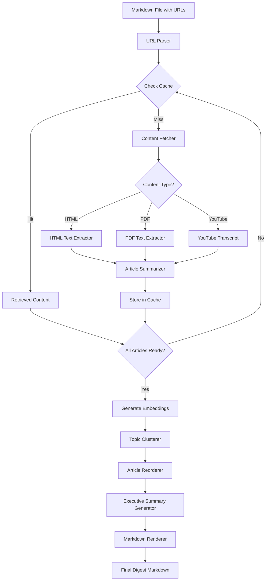

# Briefly Architecture

## Overview

Briefly is an LLM-powered news aggregator and digest generator built in Go. The system processes article URLs from markdown files, generates summaries using AI, clusters articles by topic, and produces LinkedIn-optimized digests.

**Current Version:** v3.0-phase0 (simplified architecture + observability)
**Primary Goal:** Generate weekly news digests from RSS feeds and curated URLs with theme-based classification and observability

## Architecture Philosophy

Version 3.0 represents a **breaking refactor** focused on the core workflow:

1. Collect URLs manually, from RSS feeds, or via web submission
2. Process URLs to extract and summarize content
3. Classify articles by predefined themes using LLM
4. Cluster articles by topic similarity
5. Generate executive summary from top articles
6. Render LinkedIn-ready markdown digest
7. Serve digests via web interface with PostHog analytics

**Phase 0 Enhancements:**
- **Theme-based Classification**: LLM-powered article categorization with relevance scoring
- **Manual URL Submission**: Web and CLI interfaces for one-off article submissions
- **LangFuse Observability**: LLM tracing with cost tracking and performance metrics
- **PostHog Analytics**: Product analytics for user behavior and system usage

The architecture emphasizes:
- **Clean separation of concerns** via interfaces
- **Pipeline-based processing** with adapters
- **Graceful degradation** on failures
- **Comprehensive logging** at every step
- **Observability first** with integrated tracing and analytics

## System Components

### Core Pipeline (9 Steps)

```
Markdown File → Parser → URLs
    ↓
URLs → Fetcher → Articles (with cache)
    ↓
Articles → Summarizer → Summaries (with cache)
    ↓
Summaries → LLM → Embeddings (768-dim vectors)
    ↓
Articles + Embeddings → Clusterer → TopicClusters (K-means)
    ↓
Clusters → Orderer → OrderedClusters (priority-based)
    ↓
Clusters + Articles + Summaries → Narrative → Executive Summary
    ↓
All Data → Builder → Digest Structure
    ↓
Digest → Renderer → Markdown File
```

### Component Architecture

#### 1. URL Parser
**Responsibility:** Extract and validate URLs from markdown files

**Capabilities:**
- Parse markdown links `[text](url)` and raw URLs
- Normalize URLs (remove tracking parameters)
- Deduplicate URLs

**Interface:**
```go
type URLParser interface {
    ParseMarkdownFile(filePath string) ([]core.Link, error)
}
```

**Location:** `internal/parser/`

#### 2. Content Fetcher
**Responsibility:** Retrieve raw content from URLs

**Capabilities:**
- HTTP/HTTPS requests with proper headers
- Handle redirects (max 3)
- Detect content type (HTML, PDF, YouTube)
- Apply rate limiting (100ms between requests)

**Content Type Processing:**
- **HTML:** Extract main article text using readability algorithms
- **PDF:** Extract all text pages with structure preservation
- **YouTube:** Fetch transcripts via API or scraping

**Interface:**
```go
type ContentFetcher interface {
    FetchArticle(ctx context.Context, url string) (*core.Article, error)
}
```

**Location:** `internal/fetch/`

#### 3. Article Summarizer
**Responsibility:** Generate AI-powered summaries

**Capabilities:**
- Create 150-word summaries using Gemini LLM
- Extract 3-5 key points per article
- Identify main themes
- Generate descriptive titles if missing

**Retry Strategy:**
- Max 2 retries with exponential backoff
- Fallback to simple text extraction on failure

**Interface:**
```go
type ArticleSummarizer interface {
    SummarizeArticle(ctx context.Context, article *core.Article) (*core.Summary, error)
}
```

**Location:** `internal/summarize/`

#### 4. Embedding Generator
**Responsibility:** Create vector representations for clustering

**Capabilities:**
- Generate 768-dimensional embeddings via Gemini
- Batch process multiple texts
- Normalize vectors for similarity calculations

**Interface:**
```go
type EmbeddingGenerator interface {
    GenerateEmbedding(ctx context.Context, text string) ([]float64, error)
}
```

**Location:** `internal/llm/`

#### 5. Topic Clusterer
**Responsibility:** Group similar articles

**Algorithm:** K-means clustering with cosine similarity

**Capabilities:**
- Calculate similarity matrix between articles
- Group articles with similarity > 0.7 threshold
- Generate cluster labels automatically
- Support 2-5 clusters (configurable)

**Interface:**
```go
type TopicClusterer interface {
    ClusterArticles(ctx context.Context, articles []core.Article,
        summaries []core.Summary, embeddings map[string][]float64) ([]core.TopicCluster, error)
}
```

**Location:** `internal/clustering/`

#### 6. Article Reorderer
**Responsibility:** Organize articles for optimal reading

**Strategy:**
- Order clusters by average relevance
- Within cluster: order by similarity to centroid
- Preserve chronological order for same-day articles

**Status:** Currently stubbed (returns clusters unchanged)

**Interface:**
```go
type ArticleOrderer interface {
    OrderArticles(ctx context.Context, clusters []core.TopicCluster) ([]core.TopicCluster, error)
}
```

**Location:** `internal/pipeline/adapters.go`

#### 7. Narrative Generator
**Responsibility:** Create executive summary

**Strategy:**
- Select top 3 articles from each cluster
- Concatenate summaries with cluster context
- Use LLM to generate story-driven 200-word narrative
- Identify cross-cutting themes

**Fallback:** Concatenated bullet points on LLM failure

**Interface:**
```go
type NarrativeGenerator interface {
    GenerateExecutiveSummary(ctx context.Context, clusters []core.TopicCluster,
        articles map[string]core.Article, summaries map[string]core.Summary) (string, error)
}
```

**Location:** `internal/narrative/`

#### 8. Markdown Renderer
**Responsibility:** Format final digest output

**Features:**
- LinkedIn-optimized template
- Sections: Executive Summary, Articles by Topic
- Metadata: date, article count, word count
- Source citations and references

**Interface:**
```go
type MarkdownRenderer interface {
    RenderDigest(ctx context.Context, digest *core.Digest, outputPath string) (string, error)
    RenderQuickRead(ctx context.Context, article *core.Article, summary *core.Summary) (string, error)
}
```

**Location:** `internal/templates/`, `internal/render/`

#### 9. HTTP Server (Phase 1)
**Responsibility:** Serve digests and provide REST API

**Features:**
- Chi router with middleware (CORS, logging, recovery, timeout)
- Health check and status endpoints
- RESTful API for articles, digests, feeds
- HTML pages for digest viewing
- Graceful shutdown support

**Endpoints:**

*Health & Status:*
- `GET /health` - Health check with database status
- `GET /api/status` - Server uptime and statistics

*Digest API (Phase 1 - Complete):*
- `GET /api/digests` - List all digests with metadata (title, article count, theme count, date)
- `GET /api/digests/{id}` - Get full digest with articles, summaries, executive summary, and themes
- `GET /api/digests/latest` - Get most recent digest

*Digest HTML Pages (Phase 1 - Complete):*
- `GET /` - Homepage with server info and digest viewing links
- `GET /digests` - Digest list page with card layout
- `GET /digests/{id}` - Digest detail page with:
  - Markdown-rendered executive summary (using marked.js)
  - Theme-grouped article display with emojis
  - Article summaries with relevance scores
  - Mobile-responsive TailwindCSS design

*Theme API (Phase 0 - Complete):*
- `GET /api/themes` - List themes
- `POST /api/themes` - Create theme
- `GET /api/themes/{id}` - Get theme
- `PATCH /api/themes/{id}` - Update theme
- `DELETE /api/themes/{id}` - Delete theme

*Theme HTML Pages (Phase 0 - Complete):*
- `GET /themes` - Theme management page with PostHog tracking

*Manual URL API (Phase 0 - Complete):*
- `POST /api/manual-urls` - Submit URLs (batch)
- `GET /api/manual-urls` - List URLs (with status filter)
- `GET /api/manual-urls/{id}` - Get single URL
- `POST /api/manual-urls/{id}/retry` - Retry failed URL
- `DELETE /api/manual-urls/{id}` - Delete URL

*Manual URL HTML Pages (Phase 0 - Complete):*
- `GET /submit` - URL submission page with PostHog tracking

*Future:*
- `GET /api/articles` - List articles (Phase 2)
- `GET /api/feeds` - List RSS feeds (Phase 2)

**Location:** `internal/server/`, `cmd/handlers/serve.go`

#### 10. Theme Classification System (Phase 0)
**Responsibility:** Categorize articles by predefined themes

**Features:**
- LLM-based theme classification with relevance scoring
- Support for multiple themes per article
- Minimum relevance threshold (default: 0.4 / 40%)
- Database-backed theme management

**Theme Structure:**
- Theme name, description, keywords
- Enabled/disabled state
- Created/updated timestamps

**Classification Process:**
1. Fetch enabled themes from database
2. Build classification prompt with article and themes
3. LLM analyzes article against each theme
4. Parse JSON response with relevance scores
5. Filter by minimum threshold
6. Return best match or "Uncategorized"

**Interface:**
```go
type ArticleCategorizer interface {
    CategorizeArticle(ctx context.Context, article *core.Article, summary *core.Summary) (string, error)
}
```

**PostHog Integration:**
- Track classification events with article ID and theme
- Log relevance scores for analysis
- Monitor classification performance

**Location:** `internal/themes/`, `internal/pipeline/theme_categorizer.go`

**Default Themes (10 seeded):**
- AI & Machine Learning
- Cloud & DevOps
- Software Engineering
- Web Development
- Data Engineering
- Security & Privacy
- Programming Languages
- Mobile Development
- Open Source
- Product & Startup

#### 11. Manual URL Submission System (Phase 0)
**Responsibility:** Accept and process user-submitted URLs

**Features:**
- Web form and REST API for URL submission
- CLI commands for submission and management
- Status tracking: pending → processing → processed/failed
- Integration with aggregation pipeline

**Status Workflow:**
- `pending`: URL submitted, awaiting processing
- `processing`: Currently being fetched and summarized
- `processed`: Successfully added to system
- `failed`: Processing error (with error message)

**Capabilities:**
- Bulk URL submission
- Duplicate detection
- Retry failed URLs
- Status filtering and querying
- Integration with feed items

**REST API Endpoints:**
- `POST /api/manual-urls` - Submit URLs (batch)
- `GET /api/manual-urls` - List URLs (with status filter)
- `GET /api/manual-urls/{id}` - Get single URL
- `POST /api/manual-urls/{id}/retry` - Retry failed URL
- `DELETE /api/manual-urls/{id}` - Delete URL

**CLI Commands:**
```bash
briefly manual-url add <urls...>     # Submit URLs
briefly manual-url list [--status]   # List with filter
briefly manual-url retry <id>        # Retry failed
briefly manual-url delete <id>       # Remove URL
```

**Integration:**
- Processed via `AggregateManualURLs()` method
- Converted to feed items for unified processing
- Status updated through workflow stages

**Location:** `internal/persistence/`, `internal/sources/manager.go`, `internal/server/manual_url_handlers.go`, `cmd/handlers/manual_url.go`

### Supporting Infrastructure

#### Cache Manager
**Technology:** SQLite database

**Capabilities:**
- Article content caching (24-hour TTL)
- Summary caching (7-day TTL)
- Content hash validation
- Digest metadata persistence

**Location:** `internal/store/`

#### Configuration Management
**Technology:** Viper with hierarchical loading

**Priority Order:**
1. Command-line flags (highest)
2. Environment variables (`.env` file)
3. Configuration file (`.briefly.yaml`)
4. Default values (lowest)

**Location:** `internal/config/`

#### Logging System
**Technology:** Structured logging with `slog`

**Features:**
- Contextual logging at every pipeline step
- Progress indicators with emoji
- Error tracking with stack traces
- JSON and text output formats

**Location:** `internal/logger/`

#### Database Persistence (Phase 1)
**Technology:** PostgreSQL with migration system

**Capabilities:**
- Article, summary, and digest storage
- Feed subscription management
- Migration framework with versioning
- Repository pattern for data access

**Location:** `internal/persistence/`

#### Observability Infrastructure (Phase 0)
**Technology:** LangFuse + PostHog

**LangFuse - LLM Observability:**
- **Purpose**: Track LLM API calls, costs, and performance
- **Status**: Simplified local logging implementation (SDK pending)
- **Capabilities**:
  - Trace generation with context propagation
  - Cost estimation for Gemini models
  - Token counting and latency tracking
  - Generation metadata logging

**Tracked Operations:**
- Text generation (summaries, narratives)
- Embedding generation (clustering)
- Theme classification
- Article categorization

**Cost Estimation:**
```
Gemini 2.5 Flash Preview:
- Input: $0.000015 per 1K tokens
- Output: $0.000060 per 1K tokens
```

**TracedClient Pattern:**
```go
type TracedClient struct {
    client   *Client
    langfuse *observability.LangFuseClient
    posthog  *observability.PostHogClient
}
```

**PostHog - Product Analytics:**
- **Purpose**: Track user behavior and system usage
- **SDK**: Official PostHog Go SDK (full integration)
- **Capabilities**:
  - Event tracking with properties
  - User identification
  - Feature flag support (future)
  - Session recording (future)

**Tracked Events:**
- Theme classification (`theme_classified`)
- Manual URL submission (`manual_url_submitted`)
- Digest generation (`digest_generated`)
- Article processing (`article_processed`)
- Web page views (`themes_page_viewed`, `submit_page_viewed`)

**Event Properties:**
- Article/digest IDs
- Theme names and relevance scores
- Processing timestamps
- Error states
- User identifiers (for manual submissions)

**Frontend Integration:**
- PostHog JavaScript snippet in web pages
- Automatic page view tracking
- Custom event tracking for user actions
- Privacy-respecting implementation

**Configuration:**
```yaml
observability:
  langfuse:
    enabled: true
    public_key: "pk_..."
    secret_key: "sk_..."
    host: "https://cloud.langfuse.com"
  posthog:
    enabled: true
    api_key: "phc_..."
    host: "https://app.posthog.com"
```

**Location:** `internal/observability/`, `internal/llm/traced_client.go`

## Data Flow

### Primary Workflow: Weekly Digest Pipeline



### Secondary Workflow: Quick Read Pipeline

```
Single URL → Cache Check → Fetch (if miss) → Extract → Summarize → Cache Store → Render
```

### Web Serve Workflow (Phase 1+)

```
HTTP Request → Router → Handler → Database Query → Response (JSON/HTML)
```

## Core Data Structures

### Article
```go
type Article struct {
    ID            string        // UUID
    URL           string        // Article URL
    Title         string        // Article title
    ContentType   ContentType   // html, pdf, youtube
    CleanedText   string        // Extracted content
    RawContent    string        // Original HTML/PDF
    TopicCluster  string        // Assigned cluster
    ClusterConfidence float64   // Similarity score
    Embedding     []float64     // 768-dim vector
    DateFetched   time.Time     // Fetch timestamp
}
```

### Summary
```go
type Summary struct {
    ID            string      // UUID
    ArticleIDs    []string    // Associated articles
    SummaryText   string      // Generated summary
    ModelUsed     string      // LLM model name
    DateGenerated time.Time   // Generation timestamp
}
```

### TopicCluster
```go
type TopicCluster struct {
    Label      string      // Auto-generated name
    ArticleIDs []string    // Articles in cluster
    Centroid   []float64   // K-means centroid
}
```

### Digest
```go
type Digest struct {
    ArticleGroups []ArticleGroup  // Clustered articles
    DigestSummary string          // Executive summary
    Metadata      DigestMetadata  // Title, date, count
}
```

### Theme (Phase 0)
```go
type Theme struct {
    ID          string      // UUID
    Name        string      // Theme name (unique)
    Description string      // Theme description
    Keywords    []string    // Relevant keywords
    Enabled     bool        // Active state
    CreatedAt   time.Time   // Creation timestamp
    UpdatedAt   time.Time   // Last update timestamp
}
```

### ManualURL (Phase 0)
```go
type ManualURL struct {
    ID           string     // UUID
    URL          string     // Submitted URL
    SubmittedBy  string     // Submitter identifier
    Status       string     // pending|processing|processed|failed
    ErrorMessage string     // Error details (if failed)
    ProcessedAt  *time.Time // Processing completion time
    CreatedAt    time.Time  // Submission timestamp
}
```

## Error Handling Strategy

### Graceful Degradation
- **Failed article fetch:** Skip article, continue with others
- **Failed summarization:** Use first 200 words as fallback
- **Failed clustering:** Treat as single cluster
- **Failed narrative:** Use bullet points instead
- **Failed executive summary:** Non-fatal, continues execution

### Critical Failures (Stop Processing)
- No valid URLs found
- All articles failed to fetch
- LLM API completely unavailable
- Database corruption detected

## Performance Characteristics

### Latency Targets
- Single article fetch + summary: < 5 seconds
- Full digest (10-15 articles): 2-3 minutes
- Clustering computation: < 1 second for 50 articles
- Cache hit ratio: > 80% for weekly digests

### Scalability
**Horizontal Scalability (Stateless Components):**
- URL Parser
- Content Fetcher
- Content Extractors
- Article Summarizer
- Embedding Generator
- Markdown Renderer

**Coordination Required (Stateful Components):**
- Cache Manager (shared state)
- Topic Clusterer (needs all articles)
- Article Reorderer (needs all clusters)
- Executive Summary Generator (needs ordered articles)

### Concurrency
**Current Status:** Articles processed sequentially
**Future:** Concurrent processing planned (max 5 concurrent)

## Technology Stack

- **Language:** Go 1.23+
- **CLI Framework:** Cobra
- **HTTP Router:** chi/v5
- **Database:** PostgreSQL (persistence), SQLite (cache)
- **LLM Provider:** Google Gemini API
- **Configuration:** Viper
- **Logging:** slog (structured logging)
- **Migrations:** Custom embedded migration system
- **Observability:** Custom LangFuse client (local logging), PostHog Go SDK
- **Analytics:** PostHog (product analytics)

## API Dependencies

**Required:**
- `GEMINI_API_KEY` - Gemini API for summarization and embeddings

**Optional (Phase 0 Observability):**
- `LANGFUSE_PUBLIC_KEY` - LangFuse public key for LLM tracing
- `LANGFUSE_SECRET_KEY` - LangFuse secret key
- `LANGFUSE_HOST` - LangFuse host URL (default: https://cloud.langfuse.com)
- `POSTHOG_API_KEY` - PostHog API key for product analytics
- `POSTHOG_HOST` - PostHog host URL (default: https://app.posthog.com)

**Future:**
- `OPENAI_API_KEY` - For future banner generation

## Project Structure

```
briefly/
├── cmd/
│   ├── briefly/main.go          # Entry point
│   └── handlers/                 # Cobra command handlers
│       ├── root_simplified.go    # Root command (digest, read, cache, serve, theme, manual-url)
│       ├── digest_simplified.go  # Weekly digest generation
│       ├── read_simplified.go    # Quick article summary
│       ├── cache.go              # Cache management
│       ├── serve.go              # HTTP server (Phase 1)
│       ├── theme.go              # Theme management (Phase 0)
│       └── manual_url.go         # Manual URL management (Phase 0)
├── internal/
│   ├── parser/                   # URL parsing from markdown
│   ├── summarize/                # Centralized summarization
│   ├── narrative/                # Executive summary generation
│   ├── pipeline/                 # Orchestration layer
│   │   ├── pipeline.go           # Core orchestrator
│   │   ├── interfaces.go         # Component contracts
│   │   ├── adapters.go           # Wrapper adapters
│   │   ├── builder.go            # Fluent API construction
│   │   └── theme_categorizer.go  # Theme classification integration (Phase 0)
│   ├── clustering/               # K-means clustering
│   ├── core/                     # Core data structures (Article, Summary, Theme, ManualURL)
│   ├── fetch/                    # Content fetching
│   ├── llm/                      # LLM client (Gemini)
│   │   └── traced_client.go      # Observability-wrapped client (Phase 0)
│   ├── themes/                   # Theme classification (Phase 0)
│   │   └── classifier.go         # LLM-based theme classifier
│   ├── observability/            # Observability infrastructure (Phase 0)
│   │   ├── langfuse.go           # LangFuse client (local logging)
│   │   └── posthog.go            # PostHog client
│   ├── sources/                  # Content source management
│   │   └── manager.go            # Manual URL aggregation (Phase 0)
│   ├── store/                    # SQLite caching
│   ├── persistence/              # PostgreSQL storage
│   │   ├── migrations/           # Database migrations (003-006 for Phase 0)
│   │   ├── interfaces.go         # Repository interfaces (Theme, ManualURL)
│   │   └── postgres_repos.go     # Repository implementations
│   ├── server/                   # HTTP server
│   │   ├── server.go             # Server setup with Phase 0 routes
│   │   ├── theme_handlers.go     # Theme REST API (Phase 0)
│   │   ├── manual_url_handlers.go # Manual URL REST API (Phase 0)
│   │   └── web_pages.go          # HTML pages with PostHog (Phase 0)
│   ├── templates/                # Digest templates
│   ├── render/                   # Output formatting
│   ├── config/                   # Configuration (includes observability)
│   └── logger/                   # Structured logging
└── docs/                         # Documentation
    └── executions/               # Execution logs
        └── 2025-10-31.md         # Phase 0 completion notes
```

## Development Workflow

### Building and Running
```bash
# Build
go build -o briefly ./cmd/briefly

# Run from source
go run ./cmd/briefly digest input/links.md

# Run tests
go test ./...

# Run with race detection
go test -race ./...

# Linting
golangci-lint run --timeout=5m
```

### Pipeline Construction
```go
// Build pipeline with dependencies
builder := pipeline.NewBuilder().
    WithLLMClient(llmClient).
    WithCacheDir(".briefly-cache").
    Build()

pipe, err := builder.Build()

// Execute digest generation
result, err := pipe.GenerateDigest(ctx, pipeline.DigestOptions{
    InputFile:      "input/links.md",
    OutputPath:     "digests",
    GenerateBanner: false,
})
```

## Migration from v2.0

### Breaking Changes
- 8 commands → 3 commands (digest, read, cache, serve)
- 18 packages removed (~20,000 lines)
- Service layer replaced by pipeline architecture
- Integration tests need rewrite

### Removed Features
The following packages were removed as they were not part of the core weekly digest workflow:

- `alerts/` - Alert monitoring system
- `categorization/` - Replaced by clustering
- `cost/` - API cost estimation
- `deepresearch/` - Multi-stage research pipeline
- `feeds/` - RSS feed processing (will be re-added)
- `interactive/` - Interactive selection mode
- `messaging/` - Slack/Discord integration
- `ordering/` - Article ordering (stubbed)
- `relevance/` - Relevance scoring system
- `research/` - Research query generation
- `search/` - Web search integration
- `sentiment/` - Sentiment analysis
- `services/` - Service layer
- `summaries/` - Legacy summary handling
- `trends/` - Trend analysis
- `tts/` - Text-to-speech
- `tui/` - Terminal UI browser
- `visual/` - Banner generation (future)

### Benefits
- 56% fewer packages (32 → 14)
- Focused on core workflow
- Clean architecture with interfaces
- Comprehensive logging
- Easier to maintain and extend

## Development Roadmap

### ✅ Phase 0: Observability & Manual Curation (Complete)
- ✅ LangFuse integration for LLM tracing
- ✅ PostHog integration for product analytics
- ✅ Theme-based article classification
- ✅ Manual URL submission system (CLI, API, Web)
- ✅ Database migrations (themes, manual_urls, article_themes)
- ✅ Theme management CLI and REST API
- ✅ Web pages with PostHog tracking
- ✅ TracedClient for observability-wrapped LLM calls

### ✅ Phase 1: Digest Generation & Web Viewer (85% Complete)
- ✅ **Digest generation from database** - `briefly digest generate --since N`
  - ✅ Query classified articles from database by date/theme
  - ✅ LLM-powered article summarization (with caching)
  - ✅ Executive summary generation from top articles
  - ✅ Theme-based grouping in output
  - ✅ Save to digests table with ON CONFLICT upsert
  - ✅ LinkedIn-ready markdown output
- ✅ **Web digest viewer** - REST API and HTML pages
  - ✅ REST API: GET /api/digests (list, detail, latest)
  - ✅ HTML pages: /digests (list), /digests/{id} (detail)
  - ✅ Markdown rendering with marked.js for executive summaries
  - ✅ Theme-grouped article display with relevance scores
  - ✅ Mobile-responsive TailwindCSS design
- ⏳ **RSS feed integration** (Deferred to Phase 1.5)
  - Re-add RSS feed processing with inline theme classification
  - Automatic aggregation with manual URL integration
  - Scheduled digest generation

### Phase 2: REST API Enhancements
- Implement full CRUD for articles, digests, feeds
- Add pagination, filtering, search
- Populate database statistics in status endpoint
- Theme-based filtering for all endpoints

### Phase 3: Web Frontend
- HTMX-based server-side rendering
- Article browsing and reading with theme filters
- Digest management with theme visualization
- Feed subscription interface
- Enhanced theme management UI

### Phase 4: Advanced Observability
- Full LangFuse HTTP API integration (upgrade from local logging)
- PostHog feature flags for A/B testing
- Custom dashboards for digest performance
- Cost optimization recommendations

### Phase 5: Advanced Features
- Concurrent article processing
- Executive summary improvements
- Banner image generation
- Email delivery with personalization
- User accounts and preferences
- Theme learning and adaptation

## Known Issues

1. **Executive Summary Generation:** Currently failing (non-fatal)
   - Located in `internal/narrative/generator.go`
   - Pipeline continues without it

2. **Banner Generation:** Stubbed, not implemented
   - Interface defined, adapter returns "not implemented"

3. **Article Ordering:** Stubbed implementation
   - Returns clusters unchanged

4. **Integration Tests:** Removed during cleanup
   - Need rewrite for new architecture

## References

- **User Documentation:** `README.md`
- **Configuration Guide:** `CONFIGURATION.md`
- **Development Guide:** `CLAUDE.md`
