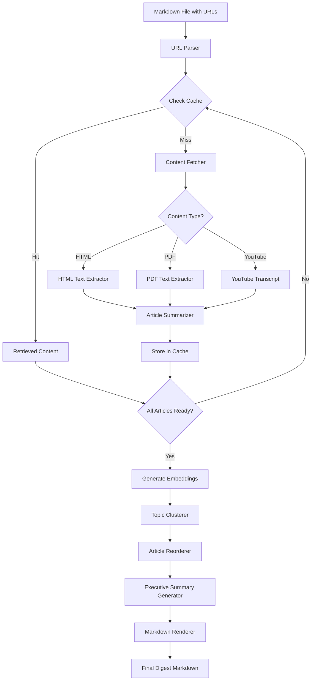

# Briefly Architecture

## Overview

Briefly is an LLM-powered news aggregator and digest generator built in Go. The system processes article URLs from markdown files, generates summaries using AI, clusters articles by topic, and produces LinkedIn-optimized digests.

**Current Version:** v3.0 (simplified architecture)
**Primary Goal:** Generate weekly news digests from RSS feeds and curated URLs

## Architecture Philosophy

Version 3.0 represents a **breaking refactor** focused on the core workflow:

1. Collect URLs manually or from RSS feeds
2. Process URLs to extract and summarize content
3. Cluster articles by topic similarity
4. Generate executive summary from top articles
5. Render LinkedIn-ready markdown digest
6. Serve digests via web interface

The architecture emphasizes:
- **Clean separation of concerns** via interfaces
- **Pipeline-based processing** with adapters
- **Graceful degradation** on failures
- **Comprehensive logging** at every step

## System Components

### Core Pipeline (9 Steps)

```
Markdown File → Parser → URLs
    ↓
URLs → Fetcher → Articles (with cache)
    ↓
Articles → Summarizer → Summaries (with cache)
    ↓
Summaries → LLM → Embeddings (768-dim vectors)
    ↓
Articles + Embeddings → Clusterer → TopicClusters (K-means)
    ↓
Clusters → Orderer → OrderedClusters (priority-based)
    ↓
Clusters + Articles + Summaries → Narrative → Executive Summary
    ↓
All Data → Builder → Digest Structure
    ↓
Digest → Renderer → Markdown File
```

### Component Architecture

#### 1. URL Parser
**Responsibility:** Extract and validate URLs from markdown files

**Capabilities:**
- Parse markdown links `[text](url)` and raw URLs
- Normalize URLs (remove tracking parameters)
- Deduplicate URLs

**Interface:**
```go
type URLParser interface {
    ParseMarkdownFile(filePath string) ([]core.Link, error)
}
```

**Location:** `internal/parser/`

#### 2. Content Fetcher
**Responsibility:** Retrieve raw content from URLs

**Capabilities:**
- HTTP/HTTPS requests with proper headers
- Handle redirects (max 3)
- Detect content type (HTML, PDF, YouTube)
- Apply rate limiting (100ms between requests)

**Content Type Processing:**
- **HTML:** Extract main article text using readability algorithms
- **PDF:** Extract all text pages with structure preservation
- **YouTube:** Fetch transcripts via API or scraping

**Interface:**
```go
type ContentFetcher interface {
    FetchArticle(ctx context.Context, url string) (*core.Article, error)
}
```

**Location:** `internal/fetch/`

#### 3. Article Summarizer
**Responsibility:** Generate AI-powered summaries

**Capabilities:**
- Create 150-word summaries using Gemini LLM
- Extract 3-5 key points per article
- Identify main themes
- Generate descriptive titles if missing

**Retry Strategy:**
- Max 2 retries with exponential backoff
- Fallback to simple text extraction on failure

**Interface:**
```go
type ArticleSummarizer interface {
    SummarizeArticle(ctx context.Context, article *core.Article) (*core.Summary, error)
}
```

**Location:** `internal/summarize/`

#### 4. Embedding Generator
**Responsibility:** Create vector representations for clustering

**Capabilities:**
- Generate 768-dimensional embeddings via Gemini
- Batch process multiple texts
- Normalize vectors for similarity calculations

**Interface:**
```go
type EmbeddingGenerator interface {
    GenerateEmbedding(ctx context.Context, text string) ([]float64, error)
}
```

**Location:** `internal/llm/`

#### 5. Topic Clusterer
**Responsibility:** Group similar articles

**Algorithm:** K-means clustering with cosine similarity

**Capabilities:**
- Calculate similarity matrix between articles
- Group articles with similarity > 0.7 threshold
- Generate cluster labels automatically
- Support 2-5 clusters (configurable)

**Interface:**
```go
type TopicClusterer interface {
    ClusterArticles(ctx context.Context, articles []core.Article,
        summaries []core.Summary, embeddings map[string][]float64) ([]core.TopicCluster, error)
}
```

**Location:** `internal/clustering/`

#### 6. Article Reorderer
**Responsibility:** Organize articles for optimal reading

**Strategy:**
- Order clusters by average relevance
- Within cluster: order by similarity to centroid
- Preserve chronological order for same-day articles

**Status:** Currently stubbed (returns clusters unchanged)

**Interface:**
```go
type ArticleOrderer interface {
    OrderArticles(ctx context.Context, clusters []core.TopicCluster) ([]core.TopicCluster, error)
}
```

**Location:** `internal/pipeline/adapters.go`

#### 7. Narrative Generator
**Responsibility:** Create executive summary

**Strategy:**
- Select top 3 articles from each cluster
- Concatenate summaries with cluster context
- Use LLM to generate story-driven 200-word narrative
- Identify cross-cutting themes

**Fallback:** Concatenated bullet points on LLM failure

**Interface:**
```go
type NarrativeGenerator interface {
    GenerateExecutiveSummary(ctx context.Context, clusters []core.TopicCluster,
        articles map[string]core.Article, summaries map[string]core.Summary) (string, error)
}
```

**Location:** `internal/narrative/`

#### 8. Markdown Renderer
**Responsibility:** Format final digest output

**Features:**
- LinkedIn-optimized template
- Sections: Executive Summary, Articles by Topic
- Metadata: date, article count, word count
- Source citations and references

**Interface:**
```go
type MarkdownRenderer interface {
    RenderDigest(ctx context.Context, digest *core.Digest, outputPath string) (string, error)
    RenderQuickRead(ctx context.Context, article *core.Article, summary *core.Summary) (string, error)
}
```

**Location:** `internal/templates/`, `internal/render/`

#### 9. HTTP Server (Phase 1)
**Responsibility:** Serve digests and provide REST API

**Features:**
- Chi router with middleware (CORS, logging, recovery, timeout)
- Health check and status endpoints
- RESTful API for articles, digests, feeds
- Graceful shutdown support

**Endpoints:**
- `GET /health` - Health check with database status
- `GET /api/status` - Server uptime and statistics
- `GET /api/articles` - List articles (Phase 2)
- `GET /api/digests` - List digests (Phase 2)
- `GET /api/feeds` - List RSS feeds (Phase 2)
- `GET /` - Homepage with server info

**Location:** `internal/server/`, `cmd/handlers/serve.go`

### Supporting Infrastructure

#### Cache Manager
**Technology:** SQLite database

**Capabilities:**
- Article content caching (24-hour TTL)
- Summary caching (7-day TTL)
- Content hash validation
- Digest metadata persistence

**Location:** `internal/store/`

#### Configuration Management
**Technology:** Viper with hierarchical loading

**Priority Order:**
1. Command-line flags (highest)
2. Environment variables (`.env` file)
3. Configuration file (`.briefly.yaml`)
4. Default values (lowest)

**Location:** `internal/config/`

#### Logging System
**Technology:** Structured logging with `slog`

**Features:**
- Contextual logging at every pipeline step
- Progress indicators with emoji
- Error tracking with stack traces
- JSON and text output formats

**Location:** `internal/logger/`

#### Database Persistence (Phase 1)
**Technology:** PostgreSQL with migration system

**Capabilities:**
- Article, summary, and digest storage
- Feed subscription management
- Migration framework with versioning
- Repository pattern for data access

**Location:** `internal/persistence/`

## Data Flow

### Primary Workflow: Weekly Digest Pipeline



### Secondary Workflow: Quick Read Pipeline

```
Single URL → Cache Check → Fetch (if miss) → Extract → Summarize → Cache Store → Render
```

### Web Serve Workflow (Phase 1+)

```
HTTP Request → Router → Handler → Database Query → Response (JSON/HTML)
```

## Core Data Structures

### Article
```go
type Article struct {
    ID            string        // UUID
    URL           string        // Article URL
    Title         string        // Article title
    ContentType   ContentType   // html, pdf, youtube
    CleanedText   string        // Extracted content
    RawContent    string        // Original HTML/PDF
    TopicCluster  string        // Assigned cluster
    ClusterConfidence float64   // Similarity score
    Embedding     []float64     // 768-dim vector
    DateFetched   time.Time     // Fetch timestamp
}
```

### Summary
```go
type Summary struct {
    ID            string      // UUID
    ArticleIDs    []string    // Associated articles
    SummaryText   string      // Generated summary
    ModelUsed     string      // LLM model name
    DateGenerated time.Time   // Generation timestamp
}
```

### TopicCluster
```go
type TopicCluster struct {
    Label      string      // Auto-generated name
    ArticleIDs []string    // Articles in cluster
    Centroid   []float64   // K-means centroid
}
```

### Digest
```go
type Digest struct {
    ArticleGroups []ArticleGroup  // Clustered articles
    DigestSummary string          // Executive summary
    Metadata      DigestMetadata  // Title, date, count
}
```

## Error Handling Strategy

### Graceful Degradation
- **Failed article fetch:** Skip article, continue with others
- **Failed summarization:** Use first 200 words as fallback
- **Failed clustering:** Treat as single cluster
- **Failed narrative:** Use bullet points instead
- **Failed executive summary:** Non-fatal, continues execution

### Critical Failures (Stop Processing)
- No valid URLs found
- All articles failed to fetch
- LLM API completely unavailable
- Database corruption detected

## Performance Characteristics

### Latency Targets
- Single article fetch + summary: < 5 seconds
- Full digest (10-15 articles): 2-3 minutes
- Clustering computation: < 1 second for 50 articles
- Cache hit ratio: > 80% for weekly digests

### Scalability
**Horizontal Scalability (Stateless Components):**
- URL Parser
- Content Fetcher
- Content Extractors
- Article Summarizer
- Embedding Generator
- Markdown Renderer

**Coordination Required (Stateful Components):**
- Cache Manager (shared state)
- Topic Clusterer (needs all articles)
- Article Reorderer (needs all clusters)
- Executive Summary Generator (needs ordered articles)

### Concurrency
**Current Status:** Articles processed sequentially
**Future:** Concurrent processing planned (max 5 concurrent)

## Technology Stack

- **Language:** Go 1.23+
- **CLI Framework:** Cobra
- **HTTP Router:** chi/v5
- **Database:** PostgreSQL (persistence), SQLite (cache)
- **LLM Provider:** Google Gemini API
- **Configuration:** Viper
- **Logging:** slog (structured logging)
- **Migrations:** Custom embedded migration system

## API Dependencies

**Required:**
- `GEMINI_API_KEY` - Gemini API for summarization and embeddings

**Optional:**
- `OPENAI_API_KEY` - For future banner generation

## Project Structure

```
briefly/
├── cmd/
│   ├── briefly/main.go          # Entry point
│   └── handlers/                 # Cobra command handlers
│       ├── root_simplified.go    # 3-command root (digest, read, cache)
│       ├── digest_simplified.go  # Weekly digest generation
│       ├── read_simplified.go    # Quick article summary
│       ├── cache.go              # Cache management
│       └── serve.go              # HTTP server (Phase 1)
├── internal/
│   ├── parser/                   # URL parsing from markdown
│   ├── summarize/                # Centralized summarization
│   ├── narrative/                # Executive summary generation
│   ├── pipeline/                 # Orchestration layer
│   │   ├── pipeline.go           # Core orchestrator
│   │   ├── interfaces.go         # Component contracts
│   │   ├── adapters.go           # Wrapper adapters
│   │   └── builder.go            # Fluent API construction
│   ├── clustering/               # K-means clustering
│   ├── core/                     # Core data structures
│   ├── fetch/                    # Content fetching
│   ├── llm/                      # LLM client (Gemini)
│   ├── store/                    # SQLite caching
│   ├── persistence/              # PostgreSQL storage
│   ├── server/                   # HTTP server
│   ├── templates/                # Digest templates
│   ├── render/                   # Output formatting
│   ├── config/                   # Configuration
│   └── logger/                   # Structured logging
└── docs/                         # Documentation
```

## Development Workflow

### Building and Running
```bash
# Build
go build -o briefly ./cmd/briefly

# Run from source
go run ./cmd/briefly digest input/links.md

# Run tests
go test ./...

# Run with race detection
go test -race ./...

# Linting
golangci-lint run --timeout=5m
```

### Pipeline Construction
```go
// Build pipeline with dependencies
builder := pipeline.NewBuilder().
    WithLLMClient(llmClient).
    WithCacheDir(".briefly-cache").
    Build()

pipe, err := builder.Build()

// Execute digest generation
result, err := pipe.GenerateDigest(ctx, pipeline.DigestOptions{
    InputFile:      "input/links.md",
    OutputPath:     "digests",
    GenerateBanner: false,
})
```

## Migration from v2.0

### Breaking Changes
- 8 commands → 3 commands (digest, read, cache, serve)
- 18 packages removed (~20,000 lines)
- Service layer replaced by pipeline architecture
- Integration tests need rewrite

### Removed Features
The following packages were removed as they were not part of the core weekly digest workflow:

- `alerts/` - Alert monitoring system
- `categorization/` - Replaced by clustering
- `cost/` - API cost estimation
- `deepresearch/` - Multi-stage research pipeline
- `feeds/` - RSS feed processing (will be re-added)
- `interactive/` - Interactive selection mode
- `messaging/` - Slack/Discord integration
- `ordering/` - Article ordering (stubbed)
- `relevance/` - Relevance scoring system
- `research/` - Research query generation
- `search/` - Web search integration
- `sentiment/` - Sentiment analysis
- `services/` - Service layer
- `summaries/` - Legacy summary handling
- `trends/` - Trend analysis
- `tts/` - Text-to-speech
- `tui/` - Terminal UI browser
- `visual/` - Banner generation (future)

### Benefits
- 56% fewer packages (32 → 14)
- Focused on core workflow
- Clean architecture with interfaces
- Comprehensive logging
- Easier to maintain and extend

## Future Roadmap

### Phase 2: REST API Endpoints
- Implement full CRUD for articles, digests, feeds
- Add pagination, filtering, search
- Populate database statistics in status endpoint

### Phase 3: Web Frontend
- HTMX-based server-side rendering
- Article browsing and reading
- Digest management
- Feed subscription interface

### Phase 4: RSS Integration
- Re-add RSS feed processing
- Scheduled digest generation
- Feed discovery and management

### Phase 5: Advanced Features
- Concurrent article processing
- Executive summary improvements
- Banner image generation
- Email delivery
- User accounts and preferences

## Known Issues

1. **Executive Summary Generation:** Currently failing (non-fatal)
   - Located in `internal/narrative/generator.go`
   - Pipeline continues without it

2. **Banner Generation:** Stubbed, not implemented
   - Interface defined, adapter returns "not implemented"

3. **Article Ordering:** Stubbed implementation
   - Returns clusters unchanged

4. **Integration Tests:** Removed during cleanup
   - Need rewrite for new architecture

## References

- **User Documentation:** `README.md`
- **Configuration Guide:** `CONFIGURATION.md`
- **Development Guide:** `CLAUDE.md`
