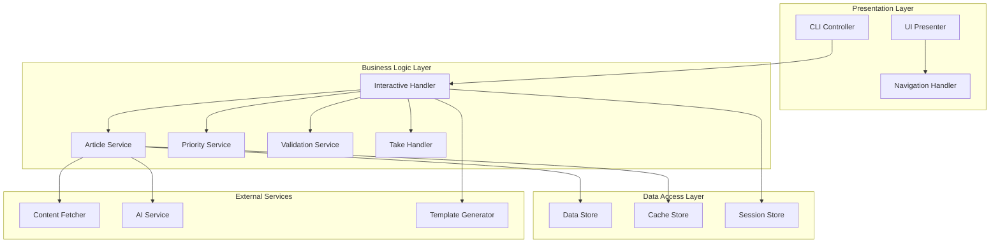

# Interactive CLI Flow - Component Responsibility Matrix

## Component Architecture Overview



## Component Responsibilities

### 1. CLI Controller
**Purpose**: Entry point and command orchestration

**Responsibilities**:
- Parse command-line arguments and flags
- Validate initial configuration
- Determine execution mode (interactive vs standard)
- Initialize appropriate handler chain
- Manage process lifecycle
- Handle global errors and cleanup

**Does NOT**:
- Implement business logic
- Directly interact with data stores
- Render UI elements
- Make network requests

**Interfaces**:
- Receives: Command-line arguments
- Provides: Parsed configuration to handlers
- Emits: Process exit codes and top-level errors

---

### 2. Interactive Handler
**Purpose**: Orchestrate interactive article selection flow

**Responsibilities**:
- Manage interactive session lifecycle
- Coordinate between UI and business services
- Maintain session state
- Handle user action routing
- Enforce flow sequencing
- Manage timeouts and cancellations

**Does NOT**:
- Render UI directly
- Fetch article content
- Calculate priority scores
- Persist data

**Interfaces**:
- Receives: Session configuration, user actions
- Provides: Session state, flow control
- Depends on: UI Presenter, Article Service, Take Handler

---

### 3. UI Presenter
**Purpose**: Manage terminal-based user interface

**Responsibilities**:
- Render article list display
- Handle keyboard/mouse input
- Manage screen updates
- Format data for display
- Provide input forms for user take
- Show validation feedback

**Does NOT**:
- Process business logic
- Make selection decisions
- Validate take content rules
- Store user selections

**Interfaces**:
- Receives: Article data, display configuration
- Provides: User selections, input text
- Emits: Navigation events, selection events

---

### 4. Article Service
**Purpose**: Manage article processing pipeline

**Responsibilities**:
- Coordinate article fetching
- Manage content extraction
- Orchestrate AI summarization
- Handle caching logic
- Batch processing optimization
- Error recovery for failed articles

**Does NOT**:
- Calculate priority scores
- Handle user interactions
- Render output
- Make selection decisions

**Interfaces**:
- Receives: Article URLs, processing options
- Provides: Processed articles with summaries
- Depends on: Content Fetcher, AI Service, Cache Store

---

### 5. Priority Service
**Purpose**: Calculate and manage article relevance scoring

**Responsibilities**:
- Calculate priority scores
- Apply scoring algorithms
- Consider user preferences
- Sort articles by relevance
- Identify potential game-changers
- Manage scoring weights

**Does NOT**:
- Fetch article content
- Store articles
- Handle UI
- Generate summaries

**Interfaces**:
- Receives: Processed articles, scoring criteria
- Provides: Scored and sorted article list
- Configuration: Scoring weights and algorithms

---

### 6. Navigation Handler
**Purpose**: Manage UI navigation state and actions

**Responsibilities**:
- Track current selection position
- Handle keyboard navigation events
- Manage pagination state
- Implement scrolling logic
- Handle quick-jump actions (Home/End)
- Maintain navigation history

**Does NOT**:
- Render UI elements
- Make business decisions
- Validate selections
- Store state permanently

**Interfaces**:
- Receives: Navigation commands
- Provides: Updated UI state
- Emits: Position change events

---

### 7. Take Handler
**Purpose**: Manage user commentary input and validation

**Responsibilities**:
- Capture user take input
- Coordinate validation
- Handle multi-line text entry
- Manage edit operations
- Store validated takes
- Handle skip/cancel actions

**Does NOT**:
- Define validation rules
- Render input UI
- Select articles
- Generate digests

**Interfaces**:
- Receives: User text input, article context
- Provides: Validated take data
- Depends on: Validation Service

---

### 8. Validation Service
**Purpose**: Enforce business rules and data validation

**Responsibilities**:
- Validate user take content
- Check length constraints
- Verify format requirements
- Apply content filters
- Provide validation feedback
- Suggest corrections

**Does NOT**:
- Store data
- Render error messages
- Make business decisions
- Handle user input directly

**Interfaces**:
- Receives: Data to validate, rule sets
- Provides: Validation results, error details
- Configuration: Validation rules and constraints

---

### 9. Session Store
**Purpose**: Manage interactive session state

**Responsibilities**:
- Store session metadata
- Track session lifecycle
- Manage session timeouts
- Provide session recovery
- Handle concurrent sessions
- Clean up expired sessions

**Does NOT**:
- Implement business logic
- Render UI
- Make decisions
- Process articles

**Interfaces**:
- Receives: Session data
- Provides: Session state retrieval
- Lifecycle: Create, read, update, delete, expire

---

### 10. Data Store
**Purpose**: Persistent storage for articles and metadata

**Responsibilities**:
- Store article content
- Persist summaries
- Save user takes
- Maintain indexes
- Handle transactions
- Manage data lifecycle

**Does NOT**:
- Process articles
- Calculate scores
- Validate data
- Render output

**Interfaces**:
- Receives: Data entities
- Provides: Query interface
- Operations: CRUD operations, batch operations

---

### 11. Cache Store
**Purpose**: Temporary storage for performance optimization

**Responsibilities**:
- Cache article content
- Store processed summaries
- Manage cache invalidation
- Implement TTL policies
- Provide cache statistics
- Handle cache warming

**Does NOT**:
- Make caching decisions
- Process data
- Validate content
- Persist permanently

**Interfaces**:
- Receives: Cacheable data with TTL
- Provides: Fast data retrieval
- Operations: Get, set, invalidate, clear

---

### 12. Content Fetcher
**Purpose**: Retrieve article content from web sources

**Responsibilities**:
- Fetch HTML content
- Handle redirects
- Manage timeouts
- Extract main content
- Handle various content types
- Implement retry logic

**Does NOT**:
- Parse content meaning
- Generate summaries
- Store content
- Make caching decisions

**Interfaces**:
- Receives: URLs, fetch options
- Provides: Raw/extracted content
- Error handling: Network errors, timeouts

---

### 13. AI Service
**Purpose**: Interface with AI/LLM for content processing

**Responsibilities**:
- Generate article summaries
- Create smart headlines
- Analyze sentiment
- Manage API interactions
- Handle rate limiting
- Implement prompt engineering

**Does NOT**:
- Fetch content
- Store results
- Make selection decisions
- Handle user interaction

**Interfaces**:
- Receives: Content, processing instructions
- Provides: AI-generated content
- Configuration: API keys, model selection

---

### 14. Template Generator
**Purpose**: Render final digest output

**Responsibilities**:
- Apply digest templates
- Format article content
- Include user takes
- Generate different formats
- Handle template variables
- Manage output styling

**Does NOT**:
- Select articles
- Process content
- Make business decisions
- Store output

**Interfaces**:
- Receives: Digest data, template selection
- Provides: Formatted output
- Configuration: Template definitions

---

## Responsibility Assignment Matrix (RACI)

| Component | Article Processing | User Interaction | Data Storage | Output Generation |
|-----------|-------------------|------------------|--------------|-------------------|
| CLI Controller | I | A | I | C |
| Interactive Handler | A/R | R | C | A |
| UI Presenter | I | R | - | I |
| Article Service | R | - | C | C |
| Priority Service | R | I | I | C |
| Navigation Handler | - | R | - | - |
| Take Handler | I | R | C | C |
| Validation Service | C | C | - | I |
| Session Store | I | C | R | I |
| Data Store | C | I | R | C |
| Cache Store | C | - | R | I |
| Content Fetcher | R | - | - | - |
| AI Service | R | - | - | C |
| Template Generator | I | I | I | R |

**Legend**:
- R = Responsible (Does the work)
- A = Accountable (Ultimately answerable)
- C = Consulted (Provides input)
- I = Informed (Kept updated)
- \- = Not involved

## Component Communication Patterns

### Event-Driven Communication
```yaml
events:
  ArticleSelected:
    publisher: UI Presenter
    subscribers: [Interactive Handler, Session Store]
    
  TakeSubmitted:
    publisher: Take Handler
    subscribers: [Interactive Handler, Data Store]
    
  SessionTimeout:
    publisher: Session Store
    subscribers: [Interactive Handler, UI Presenter]
    
  NavigationChanged:
    publisher: Navigation Handler
    subscribers: [UI Presenter]
```

### Request-Response Communication
```yaml
requests:
  ProcessArticles:
    client: Interactive Handler
    server: Article Service
    
  ValidateTake:
    client: Take Handler
    server: Validation Service
    
  GenerateDigest:
    client: Interactive Handler
    server: Template Generator
```

### Data Flow Patterns
```yaml
patterns:
  Pipeline:
    components: [Content Fetcher -> Article Service -> AI Service]
    
  Repository:
    components: [Data Store, Cache Store]
    clients: [Article Service, Session Store]
    
  Observer:
    subject: Session Store
    observers: [Interactive Handler, UI Presenter]
```