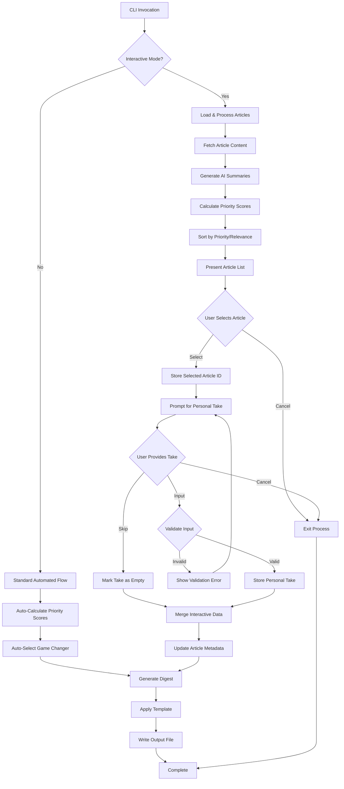
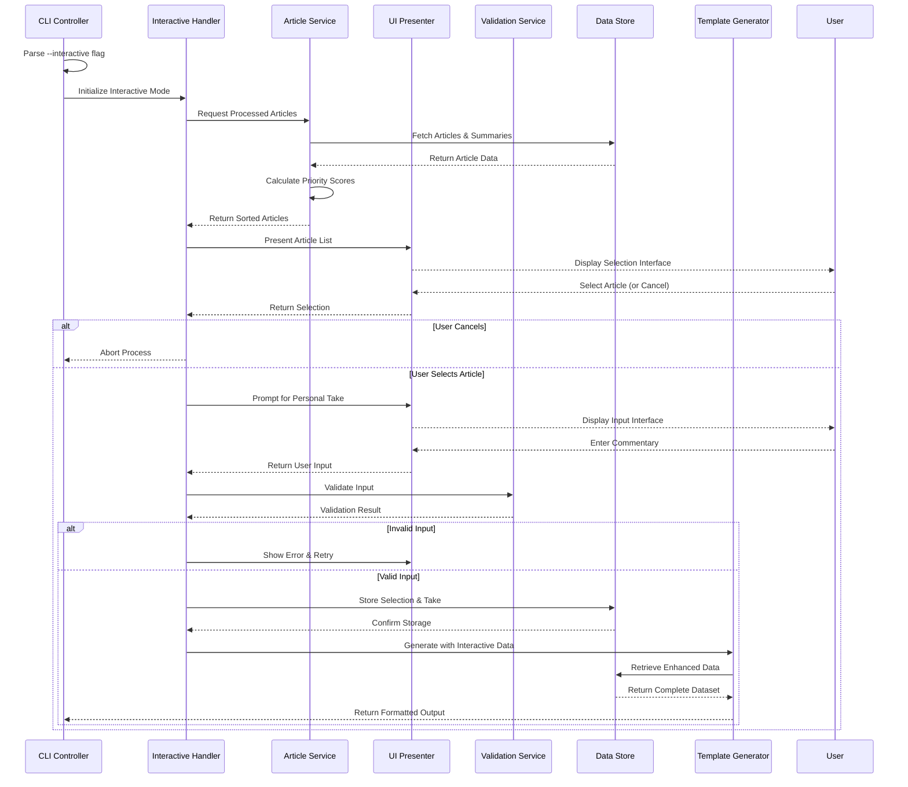
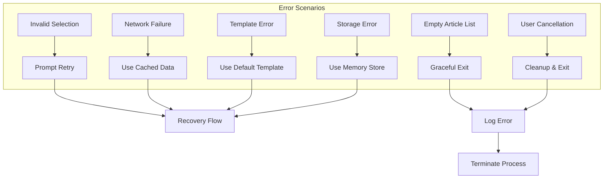
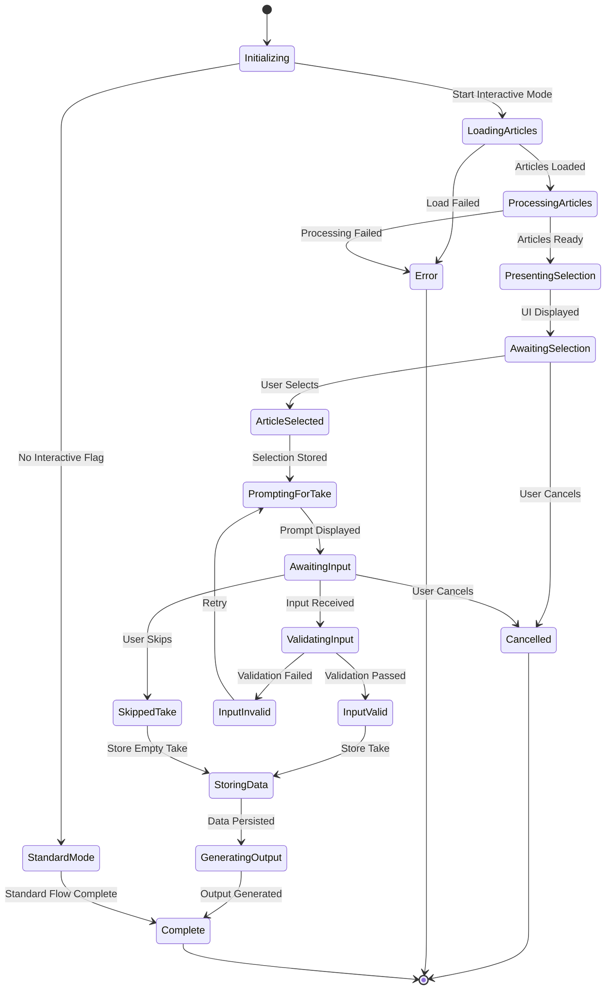

# Interactive CLI Flow - Data Flow Specification

## Overview
This document specifies the data flow for the interactive CLI mode feature in Briefly, allowing users to interactively select "Game-Changer" articles and provide personal commentary.

## Primary Data Flow

## Component Interaction Flow

## Data Transformation Pipeline

```mermaid
graph LR
    subgraph Input Stage
        Raw[Raw Article Links] --> Parse[Parse Links]
        Parse --> Fetch[Fetch Content]
    end
    
    subgraph Processing Stage
        Fetch --> Extract[Extract Text]
        Extract --> Summarize[AI Summarization]
        Summarize --> Score[Priority Scoring]
    end
    
    subgraph Interactive Stage
        Score --> Present[Format for Display]
        Present --> Select[User Selection]
        Select --> Enhance[Add User Commentary]
    end
    
    subgraph Output Stage
        Enhance --> Merge[Merge with Template Data]
        Merge --> Render[Render Final Format]
        Render --> Output[Write Output]
    end
```

## Error Handling Paths

## State Transitions

## Async vs Sync Operations

| Operation | Type | Reason | Timeout |
|-----------|------|--------|---------|
| Article Fetching | Async (Parallel) | Multiple network requests | 30s per article |
| AI Summarization | Async (Batched) | API rate limits | 60s per batch |
| Priority Scoring | Sync | Fast calculation | N/A |
| UI Presentation | Sync | User interaction | N/A |
| User Input | Sync (Blocking) | Awaiting user | Configurable |
| Take Validation | Sync | Immediate feedback | N/A |
| Data Storage | Async | Non-blocking persistence | 5s |
| Template Rendering | Sync | Fast operation | N/A |
| File Writing | Async | I/O operation | 10s |

## Decision Points

1. **Mode Selection**: `--interactive` flag presence determines flow branch
2. **Article Selection**: User choice or timeout triggers next phase
3. **Take Input**: User can provide, skip, or cancel
4. **Validation**: Input must meet minimum length and format requirements
5. **Storage Strategy**: Memory-first with async persistence to disk
6. **Error Recovery**: Each failure point has defined recovery strategy
7. **Template Selection**: Based on format flag and interactive data presence