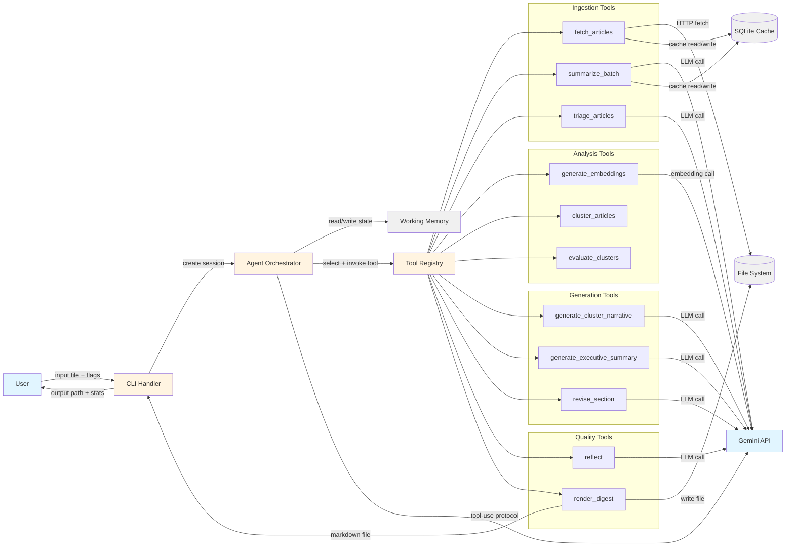
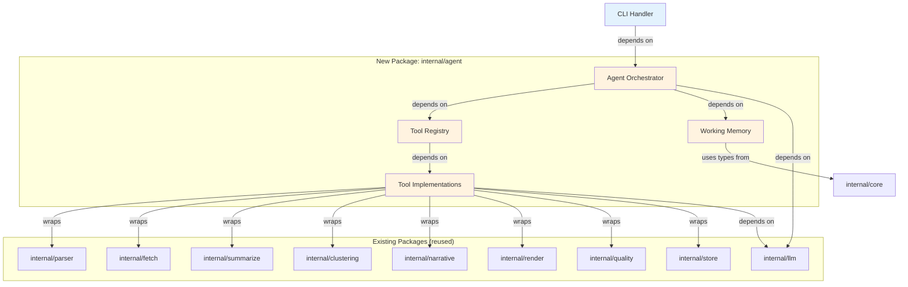

# Agentic Digest Generation: Domain Story and Data Flow

## Table of Contents
- [Primary Flow: Agentic Digest Generation](#primary-flow-agentic-digest-generation)
- [Alternative Flows](#alternative-flows)
- [Architecture Diagram](#architecture-diagram)
- [Component Responsibilities](#component-responsibilities)
- [Dependency and Integration Map](#dependency-and-integration-map)

---

## Primary Flow: Agentic Digest Generation

### Story

1. User invokes `briefly digest from-file input/weekly.md` (or `digest agent`)
2. CLI Handler creates an AgentSession with the input file path and configuration
3. Agent Orchestrator loads the input file and calls `fetch_articles` tool to retrieve all URLs
4. Agent Orchestrator receives article list and evaluates the corpus size and diversity
5. Agent Orchestrator calls `summarize_batch` tool on fetched articles (may batch or serialize depending on count)
6. Agent Orchestrator calls `triage_articles` tool to score each article for relevance and quality
7. Agent Orchestrator decides clustering strategy based on corpus size (skip clustering for fewer than 5 articles, use K-means for 5-50)
8. Agent Orchestrator calls `generate_embeddings` tool on article summaries
9. Agent Orchestrator calls `cluster_articles` tool with embeddings
10. Agent Orchestrator calls `evaluate_clusters` tool to assess cluster coherence
11. If cluster quality is low, Agent Orchestrator adjusts cluster count and repeats steps 9-10
12. Agent Orchestrator iterates over clusters, calling `generate_cluster_narrative` for each
13. Agent Orchestrator calls `generate_executive_summary` with all cluster narratives
14. Agent Orchestrator calls `reflect` tool to evaluate the full digest draft
15. Reflection returns quality scores and identified weaknesses
16. If quality is below threshold AND iteration count is below max (default 3):
    a. Agent Orchestrator calls `revise_section` for each weak section identified
    b. Agent Orchestrator calls `reflect` again on revised output
    c. Loop continues until quality is acceptable or max iterations reached
17. Agent Orchestrator calls `render_digest` to produce final markdown output
18. CLI Handler writes output file and reports processing stats to User

### Alternative Flow: Small Corpus (fewer than 5 articles)

1. User invokes digest generation with a small input file
2. Agent Orchestrator fetches and summarizes all articles
3. Agent Orchestrator skips embedding generation and clustering entirely
4. Agent Orchestrator calls `generate_executive_summary` directly from article summaries
5. Agent Orchestrator runs reflect/revise cycle as normal
6. Agent Orchestrator renders markdown without cluster groupings

### Alternative Flow: Low Quality After Max Iterations

1. Agent Orchestrator completes max reflection iterations (default 3)
2. Quality score remains below threshold
3. Agent Orchestrator logs a warning with the final quality assessment
4. Agent Orchestrator proceeds with best-effort output, annotating the digest with quality metadata
5. Render includes quality scores in output metadata for user review

### Alternative Flow: Fetch Failures

1. Agent Orchestrator calls `fetch_articles` tool
2. Some URLs fail to fetch (timeouts, 404s, paywalls)
3. Agent Orchestrator logs failures and continues with successfully fetched articles
4. If fewer than 2 articles succeed, Agent Orchestrator returns an error
5. If partial success, Agent Orchestrator adjusts strategy (smaller cluster count, simpler summary)

### Alternative Flow: Reflection Identifies Missing Coverage

1. `reflect` tool identifies that important articles are not cited in executive summary
2. Agent Orchestrator calls `revise_section` targeting the executive summary
3. Revision prompt includes the uncited articles and instructions to incorporate them
4. Agent Orchestrator re-reflects to verify coverage improved

### Actors

- **User**: Person running the CLI to generate a weekly digest
- **Gemini API**: External LLM service providing text generation, embeddings, and tool-use orchestration

### Systems/Services

- **CLI Handler**: Parses command-line arguments, creates agent session, writes output files
- **Agent Orchestrator**: LLM-driven controller that decides which tools to call and in what order; maintains working memory across the session
- **Tool Registry**: Maps tool names to their Go implementations; validates inputs/outputs
- **Working Memory**: In-memory state store holding articles, summaries, clusters, narratives, and reflection history

### Work Objects

- **AgentSession**: Configuration and state for one digest generation run
- **ArticleCorpus**: Collection of fetched and summarized articles
- **ClusterSet**: Groups of topically similar articles with coherence scores
- **DigestDraft**: Current version of the digest including narratives and executive summary
- **ReflectionReport**: Quality assessment with scores and identified weaknesses
- **RevisionRequest**: Targeted instruction to improve a specific section

---

## Architecture Diagram

### Layout Rules Applied
- Left-to-right: User to CLI to Agent to Tools to Data/External
- Top-to-bottom: Tool categories grouped vertically
- Domain-level granularity (packages, not functions)

### Diagram


```mermaid
graph LR
    User[User]
    CLI[CLI Handler]
    Agent[Agent Orchestrator]
    Memory[Working Memory]
    Registry[Tool Registry]

    subgraph Tools_Ingestion["Ingestion Tools"]
        FetchTool[fetch_articles]
        SummarizeTool[summarize_batch]
        TriageTool[triage_articles]
    end

    subgraph Tools_Analysis["Analysis Tools"]
        EmbedTool[generate_embeddings]
        ClusterTool[cluster_articles]
        EvalClusterTool[evaluate_clusters]
    end

    subgraph Tools_Generation["Generation Tools"]
        NarrativeTool[generate_cluster_narrative]
        ExecSummaryTool[generate_executive_summary]
        ReviseTool[revise_section]
    end

    subgraph Tools_Quality["Quality Tools"]
        ReflectTool[reflect]
        RenderTool[render_digest]
    end

    GeminiAPI[Gemini API]
    Cache[(SQLite Cache)]
    FileSystem[(File System)]

    User -->|"input file + flags"| CLI
    CLI -->|"create session"| Agent
    Agent -->|"read/write state"| Memory
    Agent -->|"select + invoke tool"| Registry
    Registry --> FetchTool
    Registry --> SummarizeTool
    Registry --> TriageTool
    Registry --> EmbedTool
    Registry --> ClusterTool
    Registry --> EvalClusterTool
    Registry --> NarrativeTool
    Registry --> ExecSummaryTool
    Registry --> ReviseTool
    Registry --> ReflectTool
    Registry --> RenderTool

    FetchTool -->|"HTTP fetch"| FileSystem
    SummarizeTool -->|"LLM call"| GeminiAPI
    TriageTool -->|"LLM call"| GeminiAPI
    EmbedTool -->|"embedding call"| GeminiAPI
    NarrativeTool -->|"LLM call"| GeminiAPI
    ExecSummaryTool -->|"LLM call"| GeminiAPI
    ReviseTool -->|"LLM call"| GeminiAPI
    ReflectTool -->|"LLM call"| GeminiAPI
    RenderTool -->|"write file"| FileSystem

    FetchTool -->|"cache read/write"| Cache
    SummarizeTool -->|"cache read/write"| Cache

    Agent -->|"tool-use protocol"| GeminiAPI
    RenderTool -->|"markdown file"| CLI
    CLI -->|"output path + stats"| User

    style User fill:#e1f5ff
    style GeminiAPI fill:#e1f5ff
    style Agent fill:#fff4e1
    style CLI fill:#fff4e1
    style Registry fill:#fff4e1
    style Memory fill:#f0f0f0
    style Cache fill:#f0f0f0
    style FileSystem fill:#f0f0f0
```

### Component Placement

**Left Zone (External Entities):**
- User

**Center-Left Zone (Application Layer):**
- CLI Handler

**Center Zone (Orchestration):**
- Agent Orchestrator
- Working Memory
- Tool Registry

**Center-Right Zone (Tool Implementations):**
- Ingestion Tools (fetch, summarize, triage)
- Analysis Tools (embed, cluster, evaluate)
- Generation Tools (narrative, executive summary, revise)
- Quality Tools (reflect, render)

**Right Zone (External Systems / Data):**
- Gemini API
- SQLite Cache
- File System

### Key Flows

1. **Orchestration Loop (Synchronous)**: Agent -> Tool Registry -> Tool -> Gemini API -> Tool -> Tool Registry -> Agent
2. **State Management**: Agent <-> Working Memory (read/write on every tool call)
3. **Reflect/Revise Cycle**: Agent -> reflect -> (if weak) -> revise_section -> reflect -> ... (max N iterations)
4. **Cache Path**: fetch_articles / summarize_batch -> SQLite Cache (read first, write on miss)

---

## Agent Orchestration Data Flow

```
                    +-----------------+
                    |   User Input    |
                    | (file + config) |
                    +--------+--------+
                             |
                             v
                    +--------+--------+
                    |  CLI Handler    |
                    | (parse args,    |
                    |  create session)|
                    +--------+--------+
                             |
                             v
              +--------------+--------------+
              |      Agent Orchestrator      |
              |  (Gemini with tool-use)      |
              |                              |
              |  System Prompt:              |
              |  "You are a digest editor.   |
              |   Use tools to fetch,        |
              |   analyze, and synthesize    |
              |   articles into a digest."   |
              +--------------+---------------+
                             |
            +----------------+----------------+
            |    Agent Decision Loop          |
            |                                 |
            |  1. Assess current state        |
            |  2. Choose next tool call       |
            |  3. Execute tool                |
            |  4. Update working memory       |
            |  5. Decide: continue or done?   |
            +---------------------------------+
                             |
        +--------------------+--------------------+
        |                    |                     |
        v                    v                     v
  +-----------+      +-----------+          +-----------+
  | Ingestion |      | Analysis  |          | Generation|
  | Phase     |      | Phase     |          | Phase     |
  |           |      |           |          |           |
  | fetch     |      | embed     |          | narrative |
  | summarize |----->| cluster   |--------->| exec summ |
  | triage    |      | evaluate  |          | reflect   |
  +-----------+      +-----------+          | revise    |
                                            +-----------+
                                                  |
                                                  v
                                            +-----------+
                                            |  Render   |
                                            |  Phase    |
                                            |           |
                                            | render    |
                                            | output    |
                                            +-----------+
```

### Reflect/Revise Cycle Detail

```
+-------------------+
| generate_cluster  |
| _narrative (x N)  |
+--------+----------+
         |
         v
+--------+----------+
| generate_executive|
| _summary          |
+--------+----------+
         |
         v
+--------+----------+       +------------------+
|     reflect       |------>| Quality Scores:  |
| (evaluate output) |       | - Specificity    |
+--------+----------+       | - Grounding      |
         |                  | - Coherence      |
         |                  | - Reader Value   |
         |                  | - Coverage       |
         v                  +------------------+
   /------------\
  / All scores   \----YES--> render_digest
  \ above        /
   \ threshold? /
    \----------/
         |
         NO (and iteration < max)
         |
         v
+--------+----------+
|   revise_section  |
| (targeted fixes   |
|  based on reflect |
|  weaknesses)      |
+--------+----------+
         |
         v
   Back to reflect
```

---

## Component Responsibilities

### CLI Handler (`cmd/handlers/`)
**Responsibilities:**
- Parse `digest from-file` or `digest agent` command flags
- Create AgentSession with configuration (max iterations, quality threshold)
- Invoke Agent Orchestrator
- Write rendered output to file system
- Report processing stats (time, iterations, quality scores)

**NOT Responsible For:**
- Deciding tool execution order
- Quality evaluation
- LLM interactions

**Dependencies:**
- Agent Orchestrator (invocation)

---

### Agent Orchestrator (`internal/agent/orchestrator.go`)
**Responsibilities:**
- Maintain conversation with Gemini using tool-use protocol
- Decide which tool to call next based on current state
- Manage the reflect/revise loop with iteration counting
- Track quality scores across iterations
- Detect diminishing returns and stop early
- Handle tool execution errors gracefully (retry or skip)

**NOT Responsible For:**
- Implementing tool logic (delegates to existing packages)
- Caching (handled by individual tools)
- File I/O (handled by render tool and CLI)
- Direct LLM prompt construction for summaries/narratives (handled by tools)

**Dependencies:**
- Tool Registry (tool discovery and invocation)
- Working Memory (state persistence)
- Gemini API (orchestration decisions via tool-use)

---

### Tool Registry (`internal/agent/registry.go`)
**Responsibilities:**
- Register available tools with their schemas (name, description, parameters)
- Convert tool definitions to Gemini function declaration format
- Route tool calls from the agent to the correct Go implementation
- Validate tool inputs before execution
- Convert tool outputs back to agent-readable format

**NOT Responsible For:**
- Deciding which tool to call (agent decides)
- Tool implementation logic
- State management

**Dependencies:**
- Individual tool implementations
- Gemini SDK types (for function declaration format)

---

### Working Memory (`internal/agent/memory.go`)
**Responsibilities:**
- Store and retrieve current articles, summaries, embeddings
- Store and retrieve current clusters and narratives
- Store and retrieve the current digest draft
- Maintain reflection history (scores, weaknesses, revisions per iteration)
- Provide state snapshots for agent decision-making
- Track quality score trajectory for diminishing returns detection

**NOT Responsible For:**
- Persistent storage (in-memory only, per-session)
- Cache management (separate concern)
- Decision logic

**Dependencies:**
- Core types (`internal/core`)

---

### Tool Implementations (`internal/agent/tools/`)
**Responsibilities:**
- Each tool wraps one or more existing pipeline interfaces
- `fetch_articles`: Wraps `ContentFetcher` and `URLParser`
- `summarize_batch`: Wraps `ArticleSummarizer` with cache awareness
- `triage_articles`: New LLM call scoring articles for relevance/quality
- `generate_embeddings`: Wraps `EmbeddingGenerator`
- `cluster_articles`: Wraps `TopicClusterer`
- `evaluate_clusters`: Wraps `quality.ClusterCoherence` evaluator
- `generate_cluster_narrative`: Wraps `narrative.Generator` for single cluster
- `generate_executive_summary`: Wraps `narrative.Generator` for full digest
- `reflect`: New LLM call evaluating digest quality on multiple dimensions
- `revise_section`: New LLM call rewriting a specific section given critique
- `render_digest`: Wraps `MarkdownRenderer`

**NOT Responsible For:**
- Orchestration decisions
- State management (reads/writes through Working Memory)

**Dependencies:**
- Existing pipeline interfaces (`internal/pipeline/interfaces.go`)
- Existing implementations (`internal/fetch`, `internal/summarize`, `internal/clustering`, `internal/narrative`, `internal/render`)
- Working Memory (for state access)
- Gemini API (for LLM-powered tools: triage, reflect, revise)

---

## Dependency and Integration Map

### Service Dependencies


```mermaid
graph TD
    CLI[CLI Handler]
    Orchestrator[Agent Orchestrator]
    Registry[Tool Registry]
    Memory[Working Memory]

    subgraph ExistingPackages["Existing Packages (reused)"]
        Parser[internal/parser]
        Fetch[internal/fetch]
        Summarize[internal/summarize]
        LLM[internal/llm]
        Clustering[internal/clustering]
        Narrative[internal/narrative]
        Render[internal/render]
        Quality[internal/quality]
        Store[internal/store]
    end

    subgraph NewPackage["New Package: internal/agent"]
        Orchestrator
        Registry
        Memory
        Tools[Tool Implementations]
    end

    CLI -->|depends on| Orchestrator
    Orchestrator -->|depends on| Registry
    Orchestrator -->|depends on| Memory
    Orchestrator -->|depends on| LLM
    Registry -->|depends on| Tools
    Tools -->|wraps| Parser
    Tools -->|wraps| Fetch
    Tools -->|wraps| Summarize
    Tools -->|wraps| Clustering
    Tools -->|wraps| Narrative
    Tools -->|wraps| Render
    Tools -->|wraps| Quality
    Tools -->|wraps| Store
    Tools -->|depends on| LLM
    Memory -->|uses types from| Core[internal/core]

    style CLI fill:#e3f2fd
    style Orchestrator fill:#fff3e0
    style Registry fill:#fff3e0
    style Memory fill:#fff3e0
    style Tools fill:#fff3e0
```

### Integration Points

#### CLI Handler <-> Agent Orchestrator
- **Type:** Synchronous Go function call
- **Interface:** `Orchestrator.Run(ctx, AgentSession) (DigestResult, error)`
- **Timeout:** 10 minutes (configurable)
- **Error Handling:** Return error with partial result if available

#### Agent Orchestrator <-> Gemini API (Tool-Use Protocol)
- **Type:** Synchronous HTTP (via Gemini SDK)
- **Protocol:** Gemini tool-use / function-calling API
- **Flow:** Agent sends conversation + tool declarations -> Gemini responds with tool calls -> Agent executes tools -> Agent sends tool results back -> repeat
- **Timeout:** 60 seconds per LLM call
- **Error Handling:** Retry with exponential backoff (3 attempts)
- **Rate Limiting:** Respect Gemini API rate limits

#### Tool Registry <-> Tool Implementations
- **Type:** Synchronous Go function call
- **Interface:** `Tool.Execute(ctx, Working Memory, params map[string]any) (map[string]any, error)`
- **Error Handling:** Return structured error; agent decides whether to retry or skip

#### Tool Implementations <-> Existing Packages
- **Type:** Synchronous Go function call via pipeline interfaces
- **Interface:** Existing interfaces from `internal/pipeline/interfaces.go`
- **Adapter Pattern:** Tools wrap existing interfaces, translating between agent parameter format and Go types

### Failure Modes

| Component Failure | Impact | Mitigation |
|---|---|---|
| Gemini API rate limit | Orchestration paused | Exponential backoff with jitter; reduce batch sizes |
| Gemini API unavailable | Digest generation fails | Return error; fall back to linear pipeline |
| Single article fetch failure | Partial corpus | Log warning, continue with remaining articles |
| Cluster evaluation low quality | Suboptimal groupings | Agent adjusts cluster count and retries |
| Reflection loop timeout | Digest may be lower quality | Cap iterations; proceed with best-effort |
| Working memory corruption | Inconsistent state | Immutable state snapshots; rollback on error |
| Cache unavailable | Slower processing (no cache hits) | Disable caching gracefully; proceed without |

### Fallback Strategy

The existing linear pipeline (`Pipeline.GenerateDigests`) remains available as a fallback:
- If the agent orchestrator fails to initialize (missing API features), fall back to linear pipeline
- CLI flag `--no-agent` forces linear pipeline execution
- Agent timeout (default 10 min) triggers fallback to linear pipeline with whatever articles are already fetched
