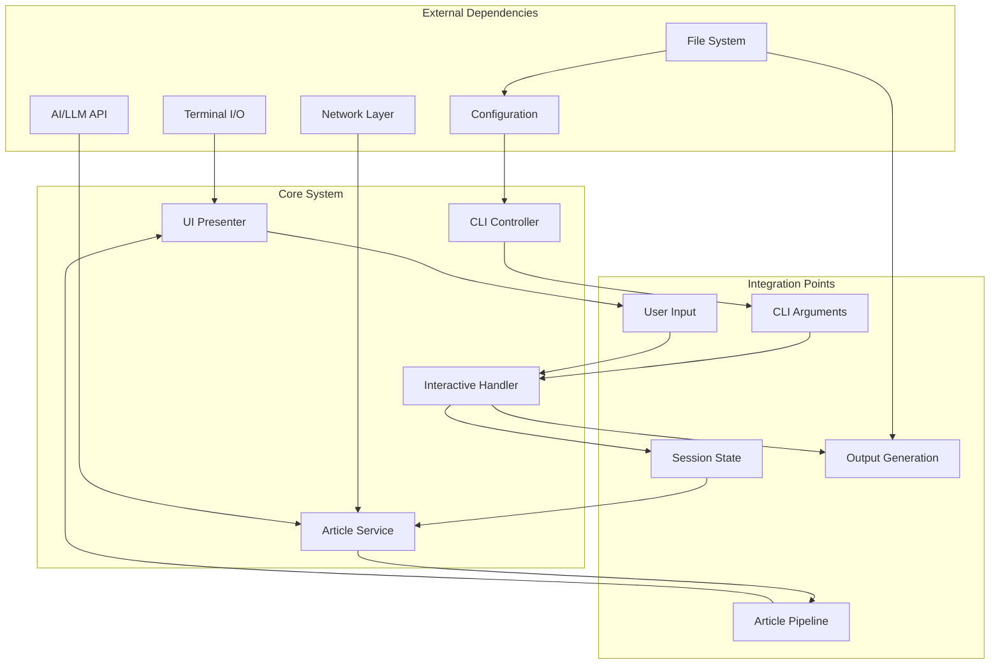
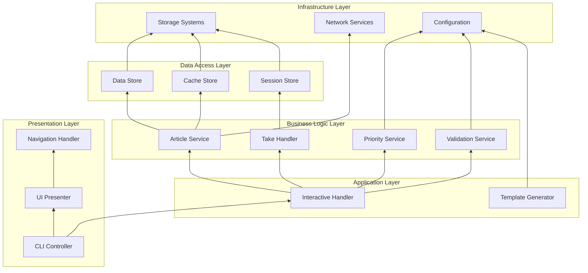

# Interactive CLI Flow - Dependencies and Integration Points

## Dependency Graph



## Component Dependencies

### Layer Dependencies


## Integration Points

### 1. CLI Arguments Integration
**Location**: Between CLI and Interactive Handler

**Contract**:
```yaml
interface: CommandLineInterface
data_flow: unidirectional
format: structured_arguments
validation: at_entry
error_handling: fail_fast

parameters:
  required:
    - source_file: path
  optional:
    - format: enum[newsletter, email, standard, brief]
    - output: path
    - interactive: boolean
    - dry_run: boolean
    
integration_pattern: parameter_object
coupling: loose
```

### 2. Session State Integration
**Location**: Between Interactive Handler and Session Store

**Contract**:
```yaml
interface: SessionManagement
data_flow: bidirectional
format: session_object
persistence: memory_with_backup
concurrency: thread_safe

operations:
  - create_session: returns session_id
  - update_state: atomic_update
  - retrieve_state: read_only
  - expire_session: cleanup_hooks
  
integration_pattern: repository
coupling: loose
transaction_boundary: session_level
```

### 3. Article Processing Pipeline Integration
**Location**: Between Article Service and External Services

**Contract**:
```yaml
interface: ArticleProcessingPipeline
data_flow: pipeline
format: streaming_with_buffering
error_handling: per_article_isolation

stages:
  1_fetch:
    service: ContentFetcher
    timeout: 30s
    retry: 3
  2_extract:
    service: ContentExtractor
    fallback: basic_extraction
  3_summarize:
    service: AIService
    batch_size: 5
    rate_limit: 60/min
    
integration_pattern: pipes_and_filters
coupling: loose
resilience: circuit_breaker
```

### 4. User Input Integration
**Location**: Between UI Presenter and Navigation/Take Handlers

**Contract**:
```yaml
interface: UserInputHandler
data_flow: event_driven
format: input_events
processing: async_with_debounce

event_types:
  navigation:
    - arrow_keys: immediate
    - page_keys: immediate
    - search: debounced_300ms
  selection:
    - enter: immediate
    - number: immediate
  text_input:
    - characters: buffered
    - commands: immediate
    
integration_pattern: observer
coupling: loose
thread_model: single_ui_thread
```

### 5. Template Rendering Integration
**Location**: Between Interactive Handler and Template Generator

**Contract**:
```yaml
interface: TemplateRendering
data_flow: request_response
format: structured_data_to_text
caching: template_compilation

data_contract:
  input:
    digest_data: object
    user_selections: object
    format: string
    options: map
  output:
    rendered_content: string
    metadata: object
    
integration_pattern: template_method
coupling: data_only
versioning: template_versioned
```

## Dependency Injection Points

```yaml
injection_points:
  CLI_Controller:
    constructor_injection:
      - ConfigurationProvider
      - HandlerFactory
    property_injection:
      - Logger
      
  Interactive_Handler:
    constructor_injection:
      - SessionStore
      - ArticleService
      - UIPresenter
    method_injection:
      - ValidationService
      
  Article_Service:
    constructor_injection:
      - ContentFetcher
      - AIService
      - CacheStore
    interface_injection:
      - StorageAdapter
      
  UI_Presenter:
    constructor_injection:
      - TerminalAdapter
      - NavigationHandler
    setter_injection:
      - ThemeProvider
```

## External System Integration

### AI/LLM Service Integration
```yaml
service: AI_Service
protocol: HTTPS_REST
authentication: API_KEY
rate_limiting: 
  requests_per_minute: 60
  tokens_per_minute: 100000
retry_strategy:
  max_attempts: 3
  backoff: exponential
  base_delay: 1000ms
fallback: cached_summaries
monitoring: latency_and_errors
```

### File System Integration
```yaml
service: File_System
operations:
  - read_source_files
  - write_output_files
  - manage_cache_directory
  - session_persistence
error_handling:
  permission_denied: graceful_degradation
  disk_full: alert_user
  file_locked: retry_with_backoff
abstraction: FileSystemAdapter
```

### Terminal I/O Integration
```yaml
service: Terminal_IO
capabilities:
  - raw_mode: keyboard_input
  - ansi_codes: colors_and_positioning
  - unicode: full_support
  - mouse: optional_support
fallback:
  no_ansi: basic_text_mode
  no_unicode: ascii_only
abstraction: TerminalAdapter
```

## Integration Testing Points

```yaml
integration_tests:
  critical_paths:
    - name: "End-to-End Interactive Flow"
      components: [CLI, InteractiveHandler, ArticleService, UIPresenter, TemplateGenerator]
      
    - name: "Article Processing Pipeline"
      components: [ArticleService, ContentFetcher, AIService, CacheStore]
      
    - name: "User Selection Flow"
      components: [UIPresenter, NavigationHandler, InteractiveHandler, SessionStore]
      
  boundary_tests:
    - name: "Network Failure Handling"
      integration_point: ContentFetcher
      scenario: network_timeout
      
    - name: "AI Service Rate Limiting"
      integration_point: AIService
      scenario: rate_limit_exceeded
      
    - name: "Session Timeout"
      integration_point: SessionStore
      scenario: session_expiry
      
  performance_tests:
    - name: "Concurrent Article Processing"
      integration_point: ArticleProcessingPipeline
      metric: throughput
      
    - name: "UI Responsiveness"
      integration_point: UserInputHandler
      metric: latency_p99
```

## Backward Compatibility Matrix

| Component | Change Type | Compatibility Strategy | Migration Path |
|-----------|------------|----------------------|----------------|
| CLI Arguments | New optional flag | Additive only | Default to old behavior |
| Session Format | Schema change | Version field | Upgrade on read |
| Article Processing | New pipeline stage | Optional stage | Feature flag |
| UI Presentation | New display mode | Mode selection | Preserve old modes |
| Template Format | New variables | Graceful missing | Optional rendering |
| Cache Structure | Format change | Parallel caches | Gradual migration |
| Config Schema | New fields | Default values | Config upgrader |

## Coupling Analysis

```yaml
coupling_metrics:
  loose_coupling:
    - CLI_to_InteractiveHandler: Interface only
    - InteractiveHandler_to_Services: Dependency injection
    - Services_to_Storage: Repository pattern
    - UI_to_Business: Event-driven
    
  tight_coupling_justified:
    - NavigationHandler_to_UIPresenter: Performance
    - SessionStore_to_Memory: Efficiency
    - TemplateGenerator_to_Format: Design requirement
    
  decoupling_opportunities:
    - ArticleService_to_AIService: Add abstraction layer
    - CacheStore_to_FileSystem: Use storage interface
    - ValidationService_to_Rules: Externalize rules
```

## Resilience Patterns

```yaml
resilience:
  circuit_breakers:
    - AIService: threshold: 5_failures, timeout: 30s
    - ContentFetcher: threshold: 3_failures, timeout: 15s
    
  retry_policies:
    - Network_Operations: exponential_backoff, max: 3
    - File_Operations: linear_backoff, max: 5
    
  fallback_strategies:
    - AI_Summarization: use_cached_or_skip
    - Content_Fetching: use_cached_or_metadata_only
    - Template_Rendering: use_default_template
    
  timeouts:
    - User_Input: 5_minutes
    - Network_Request: 30_seconds
    - AI_Processing: 60_seconds
    - Session: 1_hour
```