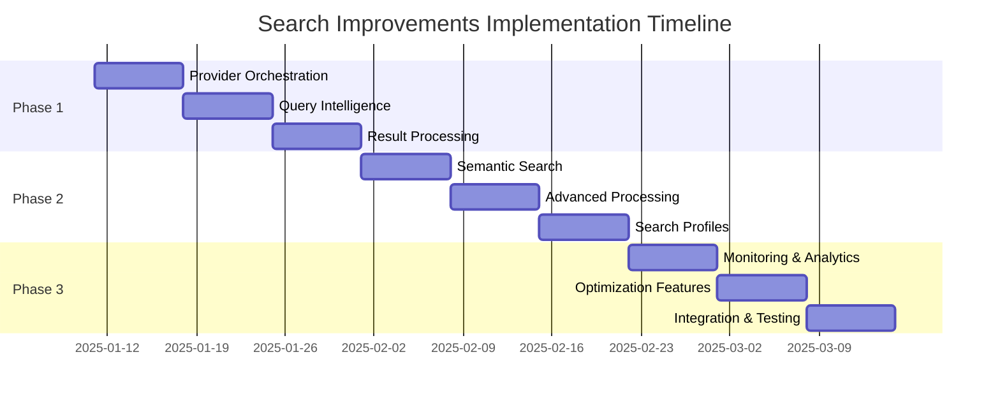

# Search Command Improvements - Execution Plan

**Version:** 1.0  
**Date:** 2025-01-11  
**Status:** Draft  
**Related:** [Search Improvements Requirements](../requirements/search-improvements.md)

## Overview

This document provides a concrete implementation plan for enhancing the search functionality based on the requirements outlined in the companion requirements document. The plan is organized into phases with clear milestones and success criteria.

## Implementation Strategy

### Phase 1: Foundation Enhancement (Weeks 1-3)
**Goal**: Improve core search reliability and basic intelligence

#### Sprint 1.1: Provider Orchestration (Week 1)
**Deliverables:**
- Enhanced provider health monitoring
- Intelligent provider selection logic
- Circuit breaker implementation
- Provider-specific query optimization

**Implementation Steps:**

1. **Create Provider Health Monitor**
   ```bash
   # Create new files
   touch internal/search/health.go
   touch internal/search/orchestrator.go
   ```
   
   Implementation:
   - `ProviderHealth` struct with metrics (response time, success rate, last failure)
   - Health check methods for each provider
   - Background health monitoring goroutine

2. **Implement Provider Orchestrator**
   - Query analysis to determine optimal provider
   - Load balancing between healthy providers
   - Automatic fallback on provider failures
   - Provider selection heuristics:
     - Google CSE: Technical and academic queries
     - SerpAPI: News and current events
     - DuckDuckGo: General queries and fallback

3. **Add Circuit Breaker Pattern**
   - Implement using `github.com/sony/gobreaker` or similar
   - Per-provider circuit breakers
   - Configurable failure thresholds and recovery times

**Testing Strategy:**
- Unit tests for health monitoring logic
- Integration tests with mock provider failures
- Load testing with concurrent requests

#### Sprint 1.2: Query Intelligence Foundation (Week 2)
**Deliverables:**
- Query intent classification
- Basic query optimization
- Query expansion with synonyms
- Domain-specific query templates

**Implementation Steps:**

1. **Create Query Intelligence Engine**
   ```bash
   touch internal/search/intelligence.go
   touch internal/search/intent.go
   ```

2. **Implement Query Intent Classification**
   - Simple keyword-based classification initially
   - Categories: technical, academic, news, general, comparison
   - Use patterns and common keywords for classification

3. **Add Query Optimization**
   - Remove stop words for technical queries
   - Add domain-specific terms (e.g., "documentation" for technical queries)
   - Optimize for each search provider's strengths

4. **Implement Query Expansion**
   - Use Gemini API for synonym generation
   - Create expansion templates for common query types
   - Cache expansions to reduce API calls

**Files to Modify:**
- `internal/search/search.go`: Add EnhancedConfig
- `internal/deepresearch/planner.go`: Integrate query optimization
- `cmd/handlers/research.go`: Add new configuration options

#### Sprint 1.3: Result Processing Enhancement (Week 3)
**Deliverables:**
- Result deduplication
- Basic quality scoring
- Enhanced result data model
- Result clustering by topic

**Implementation Steps:**

1. **Enhance Result Model**
   ```bash
   touch internal/search/processing.go
   touch internal/search/scoring.go
   ```

2. **Implement Deduplication**
   - URL normalization (remove tracking parameters, fragments)
   - Content hash-based deduplication
   - Domain-based grouping for similar results

3. **Add Quality Scoring**
   - Domain authority scoring (predefined high-quality domains)
   - Content freshness scoring
   - Relevance scoring based on keyword density
   - Combined quality score calculation

4. **Implement Basic Clustering**
   - Topic extraction using keyword analysis
   - Group results by similar domains
   - Cluster by publish date for news content

**Testing Strategy:**
- Test deduplication with known duplicate URLs
- Validate quality scoring with manually curated results
- Test clustering with diverse result sets

### Phase 2: Intelligence Enhancement (Weeks 4-6)
**Goal**: Add semantic search and advanced result processing

#### Sprint 2.1: Semantic Search Foundation (Week 4)
**Deliverables:**
- Embedding-based relevance scoring
- Semantic similarity calculation
- Content extraction and analysis

**Implementation Steps:**

1. **Add Embedding Service**
   ```bash
   touch internal/search/embeddings.go
   touch internal/search/semantic.go
   ```

2. **Implement Semantic Scoring**
   - Integrate with OpenAI embeddings API or sentence-transformers
   - Calculate query-result semantic similarity
   - Combine with keyword-based relevance scoring

3. **Enhanced Content Processing**
   - Extract full content from top results
   - Generate content summaries
   - Identify key topics and entities

#### Sprint 2.2: Advanced Result Processing (Week 5)
**Deliverables:**
- Intelligent result ranking
- Content quality analysis
- Result enrichment with metadata

**Implementation Steps:**

1. **Advanced Result Ranking**
   - Multi-factor ranking algorithm
   - Weighted combination of semantic, quality, and freshness scores
   - A/B testing framework for ranking improvements

2. **Content Quality Analysis**
   - Text quality metrics (readability, depth)
   - Source credibility assessment
   - Content type detection (tutorial, documentation, news, etc.)

#### Sprint 2.3: Search Profiles Implementation (Week 6)
**Deliverables:**
- Predefined search profiles
- Profile-specific optimization
- Configuration interface

**Implementation Steps:**

1. **Search Profile System**
   ```bash
   touch internal/search/profiles.go
   ```

2. **Profile-Specific Logic**
   - Technical: Emphasize code repositories, documentation
   - Academic: Prioritize peer-reviewed sources, arXiv
   - News: Focus on recency and news sources
   - General: Balanced approach

3. **CLI Integration**
   - Add `--profile` flag to research command
   - Configuration file support for custom profiles

### Phase 3: Advanced Features (Weeks 7-9)
**Goal**: Add monitoring, analytics, and optimization features

#### Sprint 3.1: Monitoring and Analytics (Week 7)
**Deliverables:**
- Search performance metrics
- Provider performance tracking
- Query analytics dashboard

**Implementation Steps:**

1. **Metrics Collection**
   ```bash
   touch internal/search/metrics.go
   touch internal/search/analytics.go
   ```

2. **Performance Monitoring**
   - Response time tracking per provider
   - Success rate monitoring
   - Quality score trends
   - Cost tracking per API call

3. **Analytics Dashboard**
   - CLI command for search statistics
   - Export metrics to structured format
   - Performance recommendations

#### Sprint 3.2: Optimization Features (Week 8)
**Deliverables:**
- Iterative query refinement
- Adaptive provider selection
- Caching optimization

**Implementation Steps:**

1. **Query Refinement**
   - Analyze initial result quality
   - Automatically refine queries based on results
   - Multi-iteration search for complex topics

2. **Adaptive Systems**
   - Learn from search success patterns
   - Adjust provider selection based on historical performance
   - Dynamic quality thresholds

#### Sprint 3.3: Integration and Testing (Week 9)
**Deliverables:**
- Complete end-to-end testing
- Performance optimization
- Documentation updates

**Implementation Steps:**

1. **Comprehensive Testing**
   - End-to-end search workflow tests
   - Performance benchmarking
   - Regression testing against current system

2. **Performance Optimization**
   - Profile and optimize hot paths
   - Implement result streaming for large searches
   - Optimize API usage patterns

3. **Documentation**
   - Update CLAUDE.md with new features
   - Create user guide for search profiles
   - API documentation for new interfaces

## Development Best Practices

### Code Organization
```
internal/search/
├── search.go           # Core interfaces (existing)
├── adapter.go          # Provider adapters (existing)
├── providers/          # Provider implementations
│   ├── google.go       # (move from search.go)
│   ├── duckduckgo.go   # (move from search.go)
│   ├── serpapi.go      # (move from search.go)
│   └── mock.go         # (move from search.go)
├── orchestrator.go     # Provider orchestration
├── health.go           # Health monitoring
├── intelligence.go     # Query intelligence
├── intent.go           # Intent classification
├── processing.go       # Result processing
├── scoring.go          # Quality and relevance scoring
├── embeddings.go       # Semantic search
├── semantic.go         # Semantic operations
├── profiles.go         # Search profiles
├── metrics.go          # Performance metrics
├── analytics.go        # Analytics and reporting
└── search_test.go      # (existing)
```

### Configuration Management
```yaml
# .briefly.yaml additions
search:
  providers:
    google:
      api_key: ${GOOGLE_CUSTOM_SEARCH_API_KEY}
      search_id: ${GOOGLE_CUSTOM_SEARCH_ID}
    serpapi:
      api_key: ${SERPAPI_API_KEY}
  
  orchestration:
    health_check_interval: 30s
    circuit_breaker:
      failure_threshold: 5
      recovery_timeout: 60s
  
  intelligence:
    enable_semantic_search: true
    enable_query_expansion: true
    cache_embeddings: true
  
  profiles:
    technical:
      preferred_providers: ["google", "duckduckgo"]
      quality_threshold: 0.7
      domain_preferences: ["github.com", "stackoverflow.com", "docs.*"]
    
    academic:
      preferred_providers: ["google", "serpapi"]
      quality_threshold: 0.8
      domain_preferences: ["arxiv.org", "*.edu", "scholar.google.com"]
```

### Error Handling Strategy
- Graceful degradation when providers fail
- Informative error messages with suggested fixes
- Fallback to basic search when advanced features fail
- Comprehensive logging for debugging

### Testing Strategy
```bash
# Unit tests
go test ./internal/search/... -v

# Integration tests with real APIs (use test keys)
go test ./internal/search/... -tags=integration

# Load testing
go test ./internal/search/... -bench=. -benchmem

# End-to-end testing
go test ./test/integration/search_test.go
```

## Migration Strategy

### Backward Compatibility
- Maintain existing Provider interface
- Add new interfaces alongside existing ones
- Feature flags for gradual rollout
- Fallback to current implementation on errors

### Rollout Plan
1. **Phase 1**: Deploy with feature flags disabled by default
2. **Phase 2**: Enable for internal testing with opt-in flag
3. **Phase 3**: Enable by default with opt-out option
4. **Phase 4**: Full deployment with deprecation warnings for old behavior

### Data Migration
- No breaking changes to existing stored data
- New fields added as optional extensions
- Existing cache remains compatible

## Risk Management

### Technical Risks
| Risk | Impact | Probability | Mitigation |
|------|---------|-------------|------------|
| API rate limit changes | High | Medium | Multi-provider fallback, intelligent caching |
| Provider service outages | Medium | High | Health monitoring, circuit breakers |
| Performance degradation | Medium | Medium | Performance monitoring, streaming results |
| Increased API costs | High | Medium | Usage monitoring, cost controls |

### Operational Risks
| Risk | Impact | Probability | Mitigation |
|------|---------|-------------|------------|
| Configuration complexity | Medium | High | Sensible defaults, validation |
| User adoption issues | Medium | Medium | Backward compatibility, documentation |
| Maintenance overhead | Medium | Medium | Comprehensive testing, monitoring |

## Success Metrics and Validation

### Primary Success Criteria
- **Relevance Improvement**: Top 5 search results relevance increases by 25%
- **Reliability**: Search success rate > 90%
- **Performance**: Average search time < 3 seconds

### Validation Methods
- A/B testing against current implementation
- User feedback on result quality
- Automated testing with curated query sets
- Performance benchmarking

### Monitoring Dashboard
- Search volume and success rates
- Provider health and performance
- Quality score distributions
- Cost tracking and optimization opportunities

## Dependencies and Prerequisites

### Development Dependencies
```bash
# Required Go modules
go mod tidy
go get github.com/sony/gobreaker  # Circuit breaker
go get github.com/prometheus/client_golang  # Metrics
```

### External Service Dependencies
- OpenAI API for embeddings (optional but recommended)
- Existing Google Custom Search, SerpAPI configurations
- Sufficient API quotas for increased usage during development

### Team Dependencies
- LLM expertise for query optimization
- DevOps support for monitoring setup
- QA resources for comprehensive testing

## Timeline and Milestones



### Key Milestones
- **Week 3**: Phase 1 complete - Enhanced reliability and basic intelligence
- **Week 6**: Phase 2 complete - Semantic search and advanced processing
- **Week 9**: Phase 3 complete - Full feature set with monitoring

## Next Steps

1. **Review and Approval**: Get stakeholder approval for requirements and plan
2. **Environment Setup**: Prepare development environment with required APIs
3. **Sprint Planning**: Break down Sprint 1.1 into detailed tasks
4. **Implementation Start**: Begin with provider orchestration foundation

---

*This execution plan should be reviewed and updated based on implementation learnings and changing requirements.*