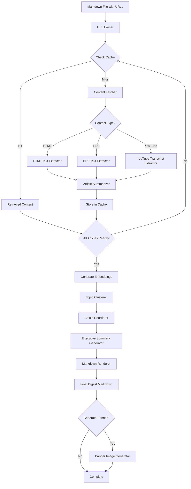
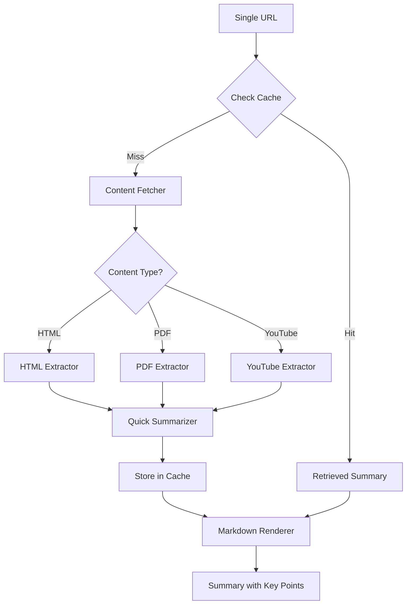

# Data Flow Specification - Content Digest System

## Primary Workflow: Weekly Digest Pipeline



## Secondary Workflow: Quick Read Pipeline



## Component Data Flow Details

### 1. URL Parser
**Input**: Markdown file content
**Processing**: Extract URLs using regex pattern matching
**Output**: List of normalized URLs
**Error Path**: Invalid URL format → Log warning, skip URL

### 2. Content Fetcher
**Input**: Single URL
**Processing**:
- Determine content type from URL/headers
- Route to appropriate extractor
- Apply rate limiting (100ms between requests)
**Output**: Raw content string
**Error Path**: Network failure → Retry 3x with exponential backoff → Mark as failed

### 3. Content Extractors
**Input**: Raw content (HTML/PDF/YouTube)
**Processing**:
- HTML: Extract main article text, remove navigation/ads
- PDF: Extract all text pages, preserve structure
- YouTube: Fetch transcript via API or scraping
**Output**: Clean text content (2000-10000 chars typical)
**Error Path**: Extraction failure → Return empty content with error flag

### 4. Article Summarizer
**Input**: Clean text content + URL metadata
**Processing**:
- Send to LLM with structured prompt
- Request 150-word summary + 3-5 key points
- Extract title if not available
**Output**: Structured summary object
**Error Path**: LLM failure → Retry 2x → Return basic extraction

### 5. Topic Clusterer
**Input**: All article summaries with embeddings
**Processing**:
- Generate embeddings for each summary
- Calculate similarity matrix (cosine similarity)
- Group articles with similarity > 0.7 threshold
- Maximum 5 clusters, minimum 2 articles per cluster
**Output**: Cluster assignments with similarity scores
**Error Path**: Clustering failure → Return single cluster (no grouping)

### 6. Article Reorderer
**Input**: Clustered articles
**Processing**:
- Order clusters by average relevance score
- Within cluster: order by similarity to cluster centroid
- Maintain chronological order for same-day articles
**Output**: Ordered list of articles with cluster IDs
**Error Path**: None (deterministic operation)

### 7. Executive Summary Generator
**Input**: Top 3 articles from each cluster
**Processing**:
- Concatenate top summaries per cluster
- Send to LLM with narrative prompt
- Request story-driven 200-word narrative
- Include cluster theme identification
**Output**: Executive summary text with cluster themes
**Error Path**: LLM failure → Use concatenated bullet points

### 8. Markdown Renderer
**Input**: Executive summary + ordered articles
**Processing**:
- Apply LinkedIn-optimized template
- Format sections: Executive Summary, Articles by Topic
- Include metadata (date, article count)
- Add source citations
**Output**: Complete markdown document
**Error Path**: Template failure → Use minimal fallback template

### 9. Banner Generator (Optional)
**Input**: Executive summary + top article titles
**Processing**:
- Generate image prompt from content
- Call image generation API
- Optimize for LinkedIn (1200x627px)
**Output**: Banner image file path
**Error Path**: Generation failure → Skip banner, log warning

## State Transitions

### Article Processing States
```
PENDING → FETCHING → EXTRACTING → SUMMARIZING → CACHED → CLUSTERED → RENDERED
         ↓          ↓            ↓             ↓
         FAILED     FAILED       FAILED        FAILED
```

### Digest Generation States
```
INITIALIZED → PROCESSING_ARTICLES → CLUSTERING → GENERATING_NARRATIVE → RENDERING → COMPLETE
            ↓                      ↓            ↓                      ↓
            PARTIAL_FAILURE        FAILED       FAILED                 FAILED
```

## Async vs Sync Operations

### Async (Parallel)
- Fetching multiple articles (max 5 concurrent)
- Generating embeddings (batch processing)
- Cache lookups (parallel reads)

### Sync (Sequential)
- Clustering (requires all embeddings)
- Executive summary generation (requires clusters)
- Final rendering (requires all components)
- Banner generation (optional, after main flow)

## Performance Targets
- Single article fetch + summary: < 5 seconds
- Full digest (10 articles): < 30 seconds
- Cache hit ratio: > 80% for weekly digests
- Clustering computation: < 1 second for 50 articles