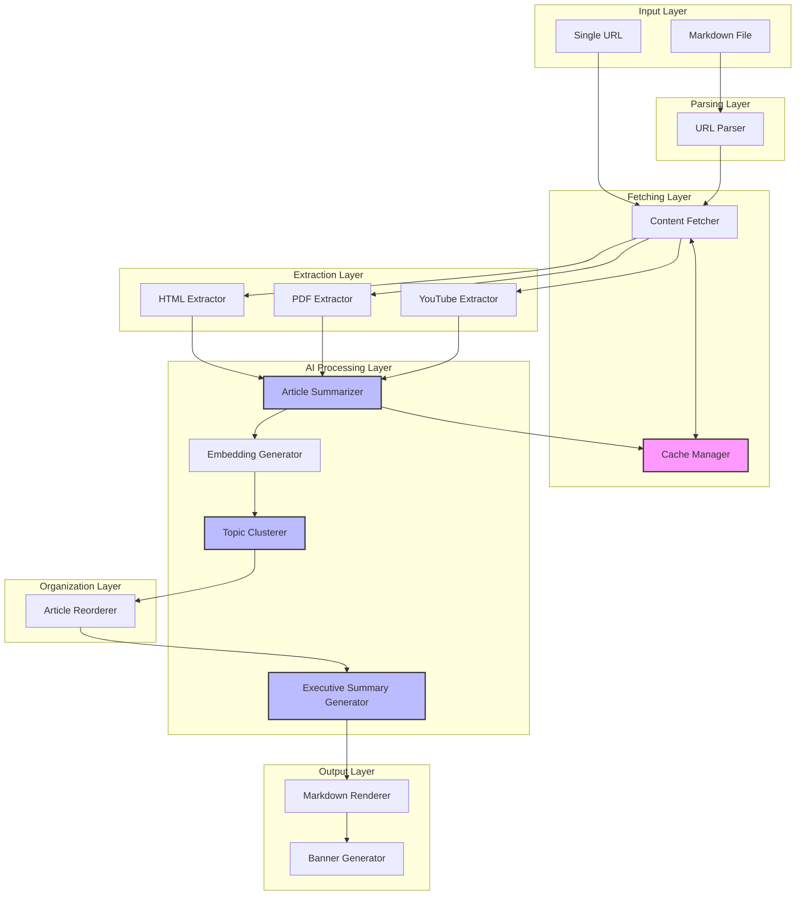

# Dependencies and Integration Points - Content Digest System

## Component Dependency Graph



## External Dependencies

### Required Services

#### LLM API (Primary)
- **Purpose**: Summarization, embedding generation, narrative creation
- **Provider**: OpenAI, Anthropic, or Google
- **Endpoints**:
  - `/v1/completions` - Text generation
  - `/v1/embeddings` - Vector generation
- **Authentication**: API key
- **Rate Limits**: 60 req/min, 150k tokens/min
- **Fallback**: Basic text extraction if unavailable

#### Image Generation API (Optional)
- **Purpose**: Banner image creation
- **Provider**: DALL-E, Midjourney, or Stable Diffusion
- **Endpoints**:
  - `/v1/images/generations` - Image creation
- **Authentication**: API key
- **Rate Limits**: 5 req/min
- **Fallback**: Skip banner if unavailable

### Library Dependencies

#### Core Libraries
```yaml
http_client:
  purpose: Web content fetching
  requirements:
    - Timeout support
    - Retry with backoff
    - Header management
    - Redirect following

html_parser:
  purpose: Extract text from HTML
  requirements:
    - Main content detection
    - Metadata extraction
    - JavaScript not required

pdf_parser:
  purpose: Extract text from PDFs
  requirements:
    - Multi-page support
    - Text extraction only
    - No OCR required

youtube_api:
  purpose: Fetch video transcripts
  requirements:
    - Transcript retrieval
    - Metadata extraction
    - No video download

markdown_parser:
  purpose: Parse and generate markdown
  requirements:
    - URL extraction
    - Template rendering
    - Syntax validation

cache_store:
  purpose: Local caching
  requirements:
    - Key-value storage
    - TTL support
    - Concurrent access
    - 500MB capacity

ml_libraries:
  purpose: Clustering and similarity
  requirements:
    - Cosine similarity
    - Hierarchical clustering
    - Vector operations
```

## Integration Points

### Input Integration

#### Markdown File Input
```yaml
interface: FileSystem
format: Markdown (.md)
encoding: UTF-8
max_size: 10MB
validation:
  - Valid markdown syntax
  - At least one URL present
  - Readable file permissions
```

#### URL Input
```yaml
interface: CLI argument or API parameter
format: String
validation:
  - Valid URL format
  - Supported protocol (http/https)
  - Accessible domain
```

### Cache Integration

#### Cache Interface
```yaml
operations:
  check:
    input: {key: string, type: enum}
    output: {exists: bool, value: any, ttl: int}

  store:
    input: {key: string, value: any, type: enum, ttl: int}
    output: {success: bool}

  evict:
    input: {key: string}
    output: {success: bool}

storage_backend: SQLite or Redis
data_format: JSON serialization
key_pattern: "{type}:{hash}"
```

### LLM Integration

#### Summarization Request
```yaml
endpoint: /v1/completions
method: POST
headers:
  Authorization: "Bearer {api_key}"
  Content-Type: "application/json"
body:
  model: "gpt-3.5-turbo"
  messages:
    - role: "system"
      content: "You are a content summarizer..."
    - role: "user"
      content: "{article_text}"
  max_tokens: 500
  temperature: 0.3
response:
  summary: string
  key_points: string[]
  theme: string
```

#### Embedding Request
```yaml
endpoint: /v1/embeddings
method: POST
headers:
  Authorization: "Bearer {api_key}"
body:
  model: "text-embedding-ada-002"
  input: ["{text1}", "{text2}"]
response:
  embeddings:
    - vector: float[768]
    - index: int
```

### Output Integration

#### Markdown Output
```yaml
format: Standard Markdown
encoding: UTF-8
structure:
  - Executive Summary
  - Table of Contents
  - Articles by Topic
  - Metadata
linkedin_optimized: true
max_length: 3000 chars for posts
```

#### Banner Image Output
```yaml
format: PNG or JPEG
dimensions: 1200x627 (LinkedIn optimized)
file_location: ./output/banners/
naming: "digest-{timestamp}.png"
```

## Service Communication Patterns

### Synchronous Dependencies
```
URL Parser → Content Fetcher
  - Blocking call
  - Returns immediately

Content Fetcher → Extractors
  - Sequential processing
  - Type-based routing

Extractors → Summarizer
  - One-to-one mapping
  - Waits for completion

Clusterer → Reorderer
  - Requires all clusters
  - Deterministic processing

Reorderer → Executive Summary
  - Needs ordered list
  - Single call

All → Markdown Renderer
  - Final aggregation
  - Template application
```

### Asynchronous Operations
```
Parallel Fetching:
  - Max 5 concurrent fetches
  - Thread pool or async/await
  - Shared rate limiter

Batch Embeddings:
  - Process up to 10 texts
  - Single API call
  - Parallel vector ops

Cache Operations:
  - Non-blocking reads
  - Background writes
  - Async eviction
```

## Error Propagation

### Critical Errors (Stop Processing)
```
URL Parser:
  - No valid URLs found
  → Abort with user message

LLM API:
  - Authentication failed
  → Abort with config error

Cache:
  - Corruption detected
  → Clear and continue
```

### Non-Critical Errors (Continue Processing)
```
Content Fetcher:
  - Single URL fails
  → Log and skip article

Extractor:
  - Cannot extract text
  → Mark as failed, continue

Summarizer:
  - LLM timeout
  → Use fallback summary

Banner Generator:
  - Image API fails
  → Skip banner creation
```

## Configuration Dependencies

### Required Configuration
```yaml
llm:
  api_key: required
  model: required
  endpoint: required

cache:
  location: "./cache"
  max_size: "500MB"
  ttl_days: 7

fetcher:
  timeout: 30
  retries: 3
  rate_limit_ms: 100
```

### Optional Configuration
```yaml
clustering:
  min_cluster_size: 2
  max_clusters: 5
  similarity_threshold: 0.7

banner:
  enabled: false
  api_key: optional
  style: "modern"

output:
  template: "linkedin"
  include_metadata: true
```

## Platform Dependencies

### Runtime Requirements
```
OS: Linux, macOS, Windows
Memory: 512MB minimum
Storage: 1GB for cache
Network: Internet access required
Permissions:
  - File system read/write
  - Network access
  - Cache directory access
```

### Development Dependencies
```
Language: Any (Python, Go, Node.js, etc.)
Build Tools: Language-specific
Testing: Unit and integration test frameworks
CI/CD: GitHub Actions or similar
```

## Version Compatibility

### API Versions
```
LLM APIs:
  - OpenAI: v1
  - Anthropic: 2023-06-01
  - Google: v1beta

Minimum versions:
  - HTTP: 1.1
  - TLS: 1.2
  - UTF-8 encoding
```

### Data Format Versions
```
Cache Format: v1
  - JSON serialization
  - Schema versioning
  - Backward compatible

Markdown Output: CommonMark
  - GitHub Flavored Markdown
  - LinkedIn compatible
```

## Security Dependencies

### Authentication
```
API Keys:
  - Environment variables
  - Config file (gitignored)
  - Never in code

Secrets Management:
  - Use secret manager if available
  - Encrypted storage
  - Rotation support
```

### Network Security
```
HTTPS Only:
  - TLS verification
  - Certificate pinning optional
  - Timeout enforcement

Rate Limiting:
  - Respect API limits
  - Internal throttling
  - Backoff on 429
```

### Data Security
```
Cache Security:
  - Local file permissions
  - No sensitive data in cache
  - Regular cleanup

Content Validation:
  - Sanitize HTML
  - Validate URLs
  - Size limits enforced
```